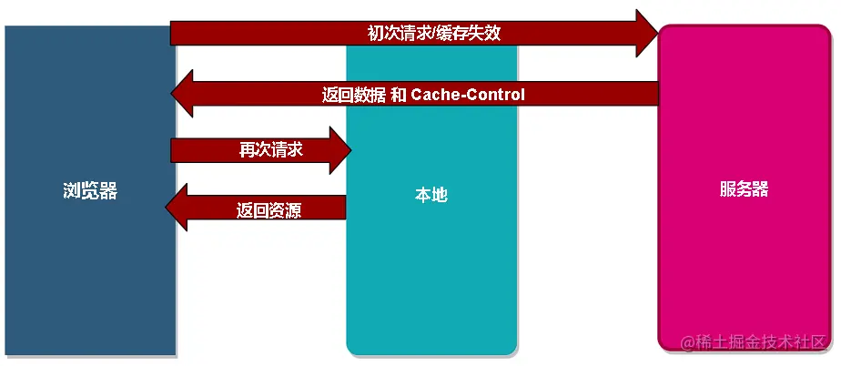
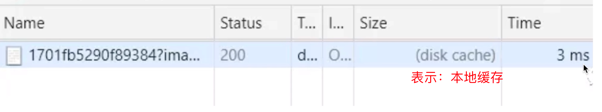
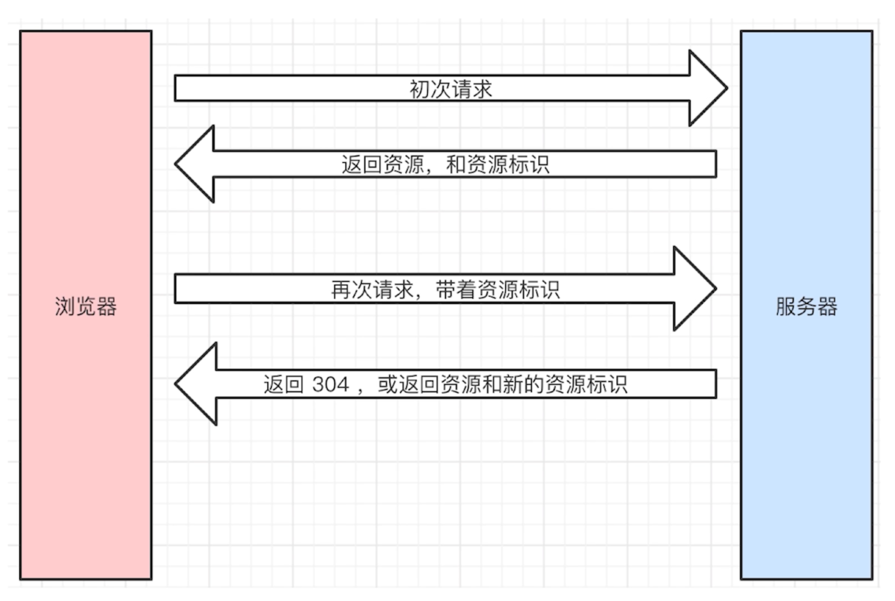
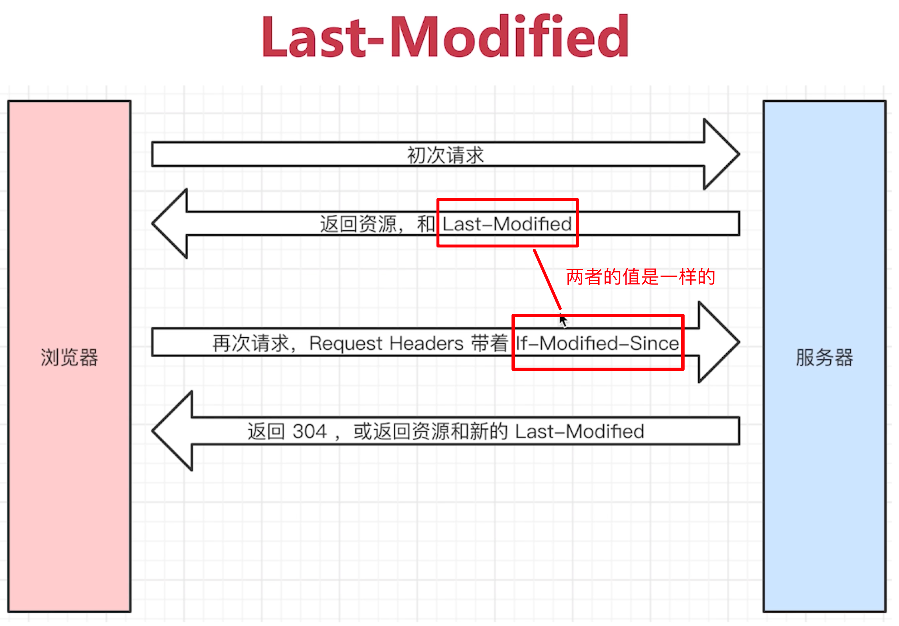
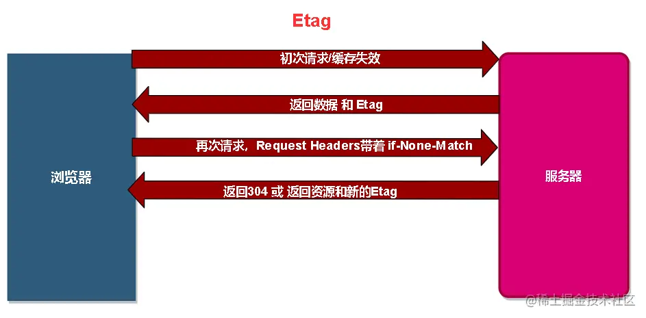
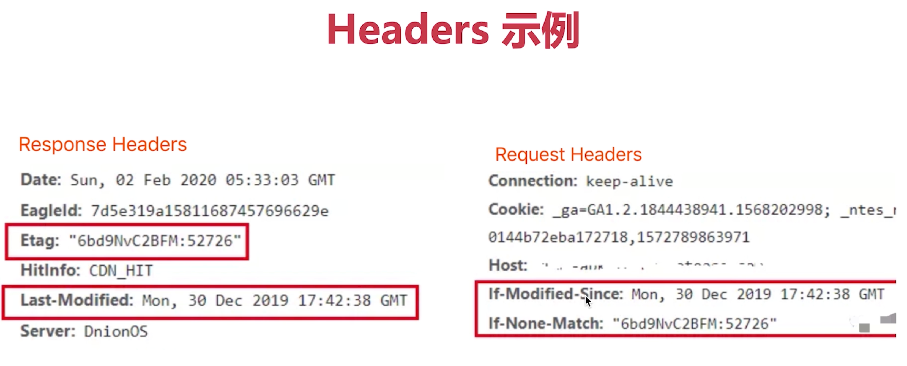
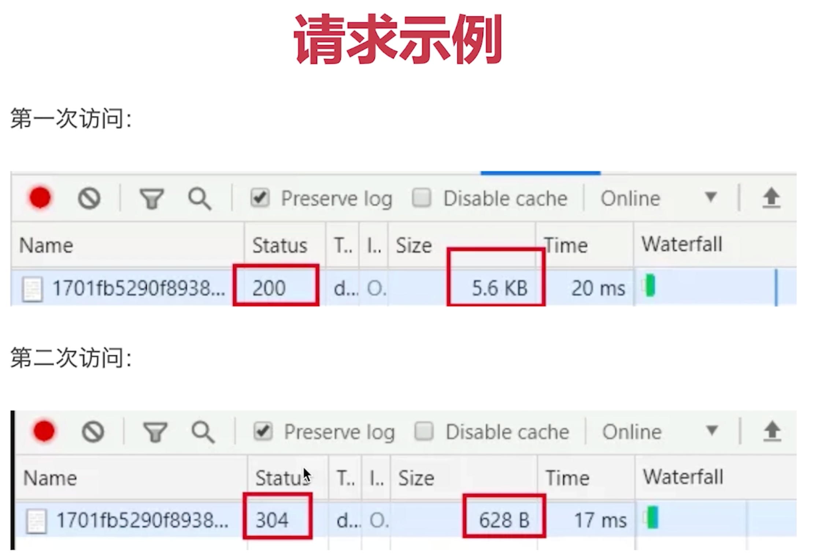
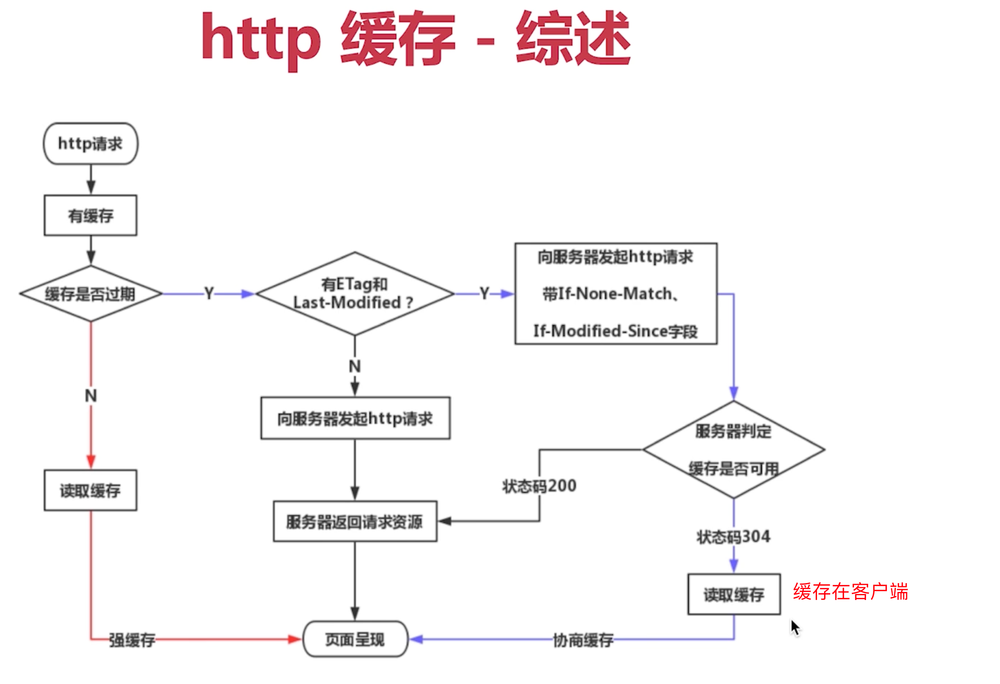
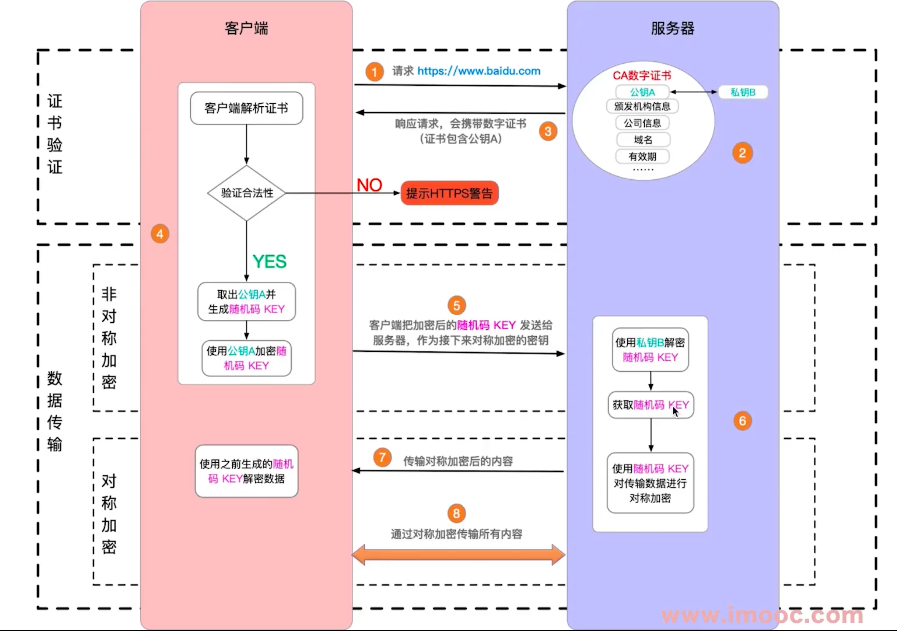

# 1: HTTP缓存

- 什么是缓存？
  - 把一些没有必要重新获取的资源，进行缓存。
  - 浏览器缓存一般都是针对静态资源（ js、css、图片等）——「webpack中加的hash」
-  为什么需要缓存？
  - 因为网络请求的加载相比于cup的计算、页面的渲染都是较慢的，所以性能优化从网络请求入手。
  - 减少网络请求的体积（带宽）和数量，减轻服务器压力，提升性能
  


## 1.1: 强制缓存

### 1.1.1: 过程图解




### 1.1.2: 请求资源图示



### 1.1.3: 资源标识

Cache-control的值

- max-age：缓存保质期。
- no-cache：不对资源进行本地缓存。
- no-store：不对资源进行缓存（包括本地缓存和服务端缓存）
- public：允许中间的路由或者协议代理可以缓存。
- privite：允许客户端可以缓存。


关于`Expires`
- 同在`Response Headers`中
- 同为控制缓存过期。
- 已被`Cache-Control`代替。

------


## 1.2: 协商缓存（对比缓存）

#### 1.2.1: 简介

> - 服务器端缓存策略。
> - 服务器判断客户端资源，是否和服务端资源一样。（注意是：服务端做的是判断）
> - 一致则返回304 , 否则返回200和最新的资源。


#### 1.2.2: 过程图解




#### 1.2.3: 资源标识

> 标识种类

- 在`Response Headers`中，有两种
- `Last-Modified`资源的最后修改时间
- `Etag`资源的唯一标识( 一个字符串，类似人类的指纹)


> 关于 `Last-Modified` 和 `Etag`

- 会优先使用`Etag`
- `Last-Modified`只能精确到秒级。
- 如果资源被重复生成，而内容不变，则`Etag`更精确











 

------


## 1.3: 综述 



------


# 2: 三种刷新操作

正常操作:地址栏输入`url` ,跳转链接,前进后退等

手动刷新: `F5`，点击刷新按钮,右击菜单刷新

强制刷新: `ctrl + F5`

- 正常操作:强制缓存有效,协商缓存有效
- 手动刷新:强制缓存失效,协商缓存有效
- 强制刷新:强制缓存失效,协商缓存失效

------


# 3: 状态码

## 3.1: 状态码分类

- 1xx服务器收到请求
- 2xx请求成功,如200
- 3xx重定向,如302
- 4xx客户端错误，如404
- 5xx服务端错误,如500


## 3.2: 常见状态码

- `200`成功
- `301`永久重定向(配合`location` ,浏览器自动处理)
- `302`临时重定向(配合`location` ,浏览器自动处理)
- `304`资源未被修改
- `404`资源未找到
- `403`没有权限
- `500`服务器错误
- `504`网关超时


> 关于协议和规范

- 就是一个约定
- 要求大家都跟着执行
- 不要违反规范,例如IE浏览器

------


# 4: `http headers`

## 4.1: `Request Headers`

- Accept浏览器可接收的数据格式
- Accept-Encoding浏览器可接收的压缩算法,如gzip
- Accept-Languange浏览器可接收的语言,如zh-CN
- Connection: keep-alive - -次TCP连接重复使用
- cookie
- Host
- User-Agent (简称UA )浏览器信息
- Content-type发送数据的格式,如application/json


## 4.2: `Response Headers`

- Content-type返回数据的格式，如application/json
- Content-length返回数据的大小，多少字节
- Content-Encoding返回数据的压缩算法，如gzip
- Set-Cookie


## 4.3: 自定义`header`【登陆模块拓展】

```js
header : {
    'X-Requested-with': 'XMLHttpRequest'
}
```

------


# 5: 加密协议【❎】

## 5.1: http和https

- http是明文传输，铭感信息容易被中间劫持。
- https=http+加密，劫持了也无法解密。
- 现代浏览器已经开始强制https协议（“有些网站会出现强制提示“该网站不安全。”）


## 5.2: 加密方式

- 对称加密：一个key同负责加密、解密。成本低、效率高

- 非对称加密：一对key，A加密之后，只能用B来解密。成本高、效率低。


https同时用到这两种加密方式。


## 5.3: https证书

- 中间人攻击
- 使用第三方证书（慎用免费、不合规的证书）【阿里云SSL证书】
- 浏览器校验证书


## 5.4: https--过程解析



------


#  6: TCP 连接 三次握手 四次挥手

> 面试策略：掌握三握四挥的过程，本质和原因


## 6.1: 建立连接

- 客户端和服务端通过 HTTP 协议发送请求，并获取内容。

- 客户端和服务端通过 TCP 协议建立连接，确定目标机器处于可接受请求的状态。

  > 在发送请求之前，需要先建立连接，确定目标机器处于可接受请求的状态。就例如，你要请快递员（第三方的）去张三家取一个东西，你必须先打电话问问他在不在家。这就是建立连接的过程。

- HTTP 协议是一个应用层的协议，它只规定了 req 和 res 的数据格式，如状态码、header、body 等。而建立网络连接需要更加底层的 TCP 协议。

- 网络连接是TCP协议，传输内容是HTTP协议。


## 6.2: 三次握手

1. 三次握手，即建立一次 TCP 连接时，客户端和服务端总共需要发送 3 个包。

> ​	举一个例子。还是你要派人去张三家取一个东西，现在你要发短信（不是打电话）“建立连接”，至少需要 3 个步骤，缺一不可。
>
> - 你：在家吗？
> - 张三：在家
> - 你：好，这就过去（然后你指派人上门，张三准备迎接）


2. 过程

- 客户端发包，服务端收到。服务端确认：客户端的发送能力是正常的。
- 服务端发包，客户端收到。客户端确认：服务端的接收能力是正常的。
- 客户端发包，服务端收到。服务端确认：客户端即将给我发送数据，我要准备接收。


3. 建立连接完成，然后就开始发送数据，通讯。


## 6.3: 四次挥手

1. 握手，是建立连接。挥手，就是告别，就是关闭连接。

> 还是之前的例子。取东西，不一定一次就取完，可能要来回很多次。而且，也不一定全部由你主动发起，过程中张三也可能会主动派人给你发送。即，你在 chrome 中看到的是一次 http 请求，其实背后可能需要好几次网络传输，只不过浏览器给合并起来了。
>
> 取东西完毕了，你要发短信“关闭连接”，告诉张三可以关门了，需要 4 个步骤。
>
> 【注意】这里你需要等着确认张三关门，才算是完全关闭连接，不能你说一声就不管了。跟日常生活不一样。
>
> - 你：完事儿了
> - 张三：好的 （此时可能还要继续给你发送，你也得继续接收。直到张三发送完）
> - 张三：我发送完毕，准备关门了
> - 你：好，关门吧 （然后你可以走了，张三可以关门了，连接结束）


2. 过程

- 客户端发包，服务端接收。服务端确认：客户端已经请求结束
- 服务端发包，客户端接收。客户端确认：服务端已经收到，我等待它关闭
- 服务端发包：客户端接受。客户端确认：服务端已经发送完成，可以关闭
- 客户端发包，服务端接收。服务端确认：可以关闭了


## 6.4: 整体图示


------


# 7:  `http methods`【❎】

## 7.1: 传统的 methods


## 7.2: 现在的 methods


## 7.3: Restful API


 