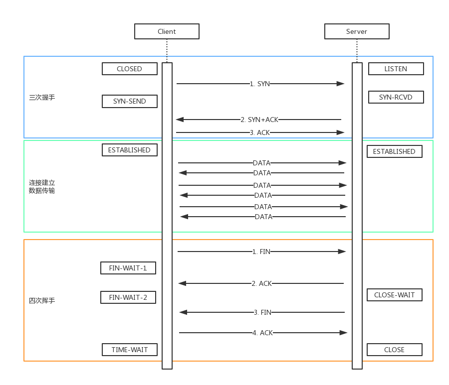

### 关于缓存

- 什么是缓存？
  - 把一些没有必要重新获取的资源，进行缓存。
  - 浏览器缓存一般都是针对静态资源（ js、css、图片等）——「webpack中加的hash」
-  为什么需要缓存？
  - 网络请求的加载相比于cup的计算、页面的渲染。
  - 减少网络请求的体积（带宽）和数量，减轻服务器压力，提升性能

 

### 强制缓存

- 
- Cache-control的值
  - max-age：缓存保质期。
  - no-cache：不对资源进行本地缓存。
  - no-store：不对资源进行缓存（包括本地缓存和服务端缓存）
  - public：允许中间的路由或者协议代理可以缓存。
  - privite：允许客户端可以缓存。
- 关于`Expires`
  - 同在`Response Headers`中
  - 同为控制缓存过期。
  - 已被`Cache-Control`代替

### 协商缓存（对比缓存）

#### 简介

> - 服务器端缓存策略。
> - 服务器判断客户端资源，是否和服务端资源一样。（注意是：服务端做的是判断）
> - 一致则返回304 , 否则返回200和最新的资源。

#### 图解

#### 资源标识

 

### 综述 

### 三种刷新操作

### https--加密协议

#### http和https

- http是明文传输，铭感信息容易被中间劫持。
- https=http+加密，劫持了也无法解密。
- 现代浏览器已经开始强制https协议（“有些网站会出现强制提示“该网站不安全。”）

#### 加密方式

对称加密：一个key同负责加密、解密。成本低、效率高

非对称加密：一对key，A加密之后，只能用B来解密。成本高、效率低。

https同时用到这两种加密方式。

#### https证书

- 中间人攻击
- 使用第三方证书（慎用免费、不合规的证书）【阿里云SSL证书】
- 浏览器校验证书

### https--过程解析

###  TCP 连接 三次握手 四次挥手

> 面试策略：掌握三握四挥的过程，本质和原因

#### 建立连接

- 客户端和服务端通过 HTTP 协议发送请求，并获取内容。

- 客户端和服务端通过 TCP 协议建立连接，确定目标机器处于可接受请求的状态。

  > 在发送请求之前，需要先建立连接，确定目标机器处于可接受请求的状态。就例如，你要请快递员（第三方的）去张三家取一个东西，你必须先打电话问问他在不在家。这就是建立连接的过程。

- HTTP 协议是一个应用层的协议，它只规定了 req 和 res 的数据格式，如状态码、header、body 等。而建立网络连接需要更加底层的 TCP 协议。

- 网络连接是TCP协议，传输内容是HTTP协议。

#### 三次握手

1. 三次握手，即建立一次 TCP 连接时，客户端和服务端总共需要发送 3 个包。

> ​	举一个例子。还是你要派人去张三家取一个东西，现在你要发短信（不是打电话）“建立连接”，至少需要 3 个步骤，缺一不可。
>
> - 你：在家吗？
> - 张三：在家
> - 你：好，这就过去（然后你指派人上门，张三准备迎接）

2. 过程

- 客户端发包，服务端收到。服务端确认：客户端的发送能力是正常的。
- 服务端发包，客户端收到。客户端确认：服务端的接收能力是正常的。
- 客户端发包，服务端收到。服务端确认：客户端即将给我发送数据，我要准备接收。

3. 建立连接完成，然后就开始发送数据，通讯。

#### 四次挥手

1. 握手，是建立连接。挥手，就是告别，就是关闭连接。

> 还是之前的例子。取东西，不一定一次就取完，可能要来回很多次。而且，也不一定全部由你主动发起，过程中张三也可能会主动派人给你发送。即，你在 chrome 中看到的是一次 http 请求，其实背后可能需要好几次网络传输，只不过浏览器给合并起来了。
>
> 取东西完毕了，你要发短信“关闭连接”，告诉张三可以关门了，需要 4 个步骤。
>
> 【注意】这里你需要等着确认张三关门，才算是完全关闭连接，不能你说一声就不管了。跟日常生活不一样。
>
> - 你：完事儿了
> - 张三：好的 （此时可能还要继续给你发送，你也得继续接收。直到张三发送完）
> - 张三：我发送完毕，准备关门了
> - 你：好，关门吧 （然后你可以走了，张三可以关门了，连接结束）

2. 过程

- 客户端发包，服务端接收。服务端确认：客户端已经请求结束
- 服务端发包，客户端接收。客户端确认：服务端已经收到，我等待它关闭
- 服务端发包：客户端接受。客户端确认：服务端已经发送完成，可以关闭
- 客户端发包，服务端接收。服务端确认：可以关闭了

#### 整体图示

 