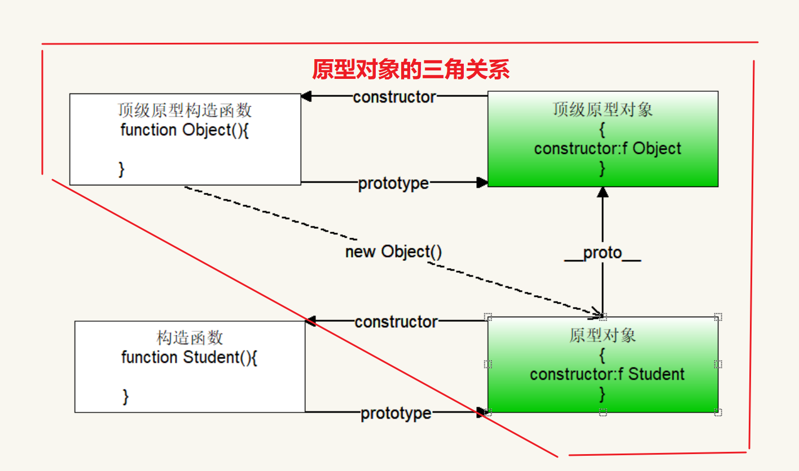
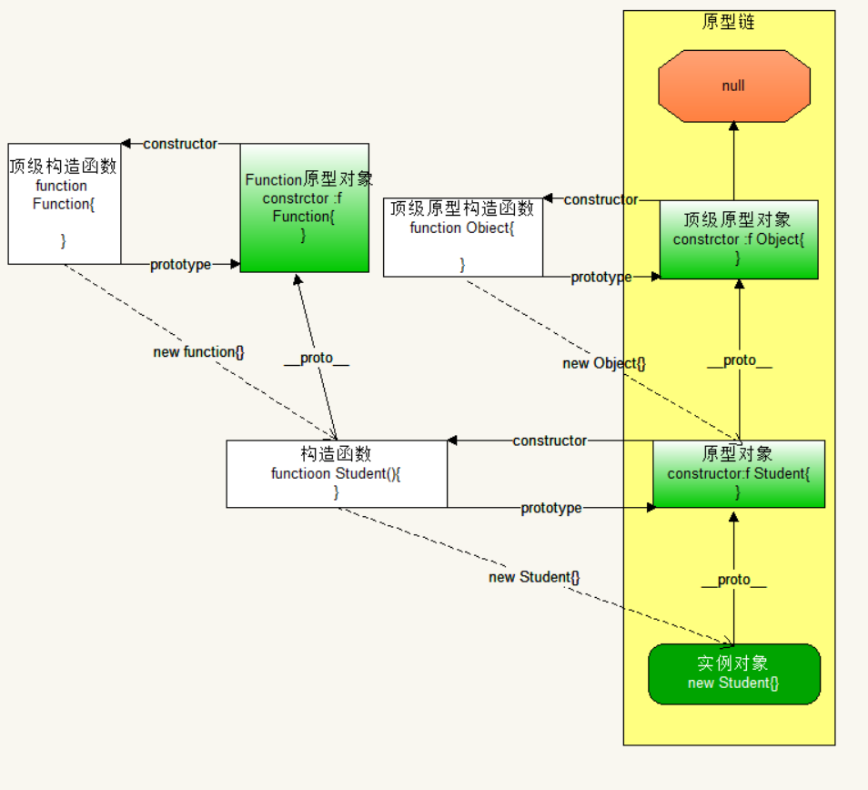

## 对象 Object

### 对象的遍历

1. 对象为什么不能使用简单for循环遍历？

   【答】：对象没有有规则的下标，无法动态生成下标（数字可以：下标从0开始，连续变化）

2. 对象遍历的方法：`for...in...`

   - 注意：

     1. 在`for...in..`中不能使用点语法。即：`对象.key` 访问的是对象中属性的名字叫做key的属性。
     1. 在`for...in..`中不能使用`obj['key']`，即：如果中括号里面的内容是一个字符串：**不会解析 obj['key'] === obj.key**
     1. 数组也可以使用for-in进行遍历，因为数组是特殊的对象。

   - 代码展示
   
     ```js
     let obj = {
         name:'安其拉',
         age:18,
         gender:'女',
         skill:'扔个球'
     }
     
     for(let key in obj){
         console.log(obj.key) //underfind
         console.log(obj[key]) //正常打印
     }
     ```


### 内部对象this

1. 定义函数时（箭头函数除外），里面会产生一个变量this

2. this的指向：谁调用函数，this就指向谁。

3. 在对象内部的属性访问（包括对象内部的函数），必须要通过对象来访问

   - 正确访问：`对象名.属性名`（弊端：万一对象的名字发生了修改，内部代码也要跟着修改）
   - 标准访问：`this.属性名`

4. 扩展---普通函数里面的this代表谁？

   【答】window对象

- 代码展示：

```js
let obj = {
    name:'安其拉',
    age:18,
    gender:'女',
    skill:'扔个球'，
    cplay: function () {
		console.log(obj.name) //安其拉
		console.log(this.name) //安其拉
		console.log(this.cplay); //打印了这个函数
		console.log(`${this.name} 正在 ${this.skill}`)  // 安其拉正在扔个球。
    }
}
```

### 注意要点

- 对象的属性名可以是数字（系统会把数字转成字符串），也可以有引号。
- 如果对象的属性名是数字：访问不能使用对象专属语法：`.语法`。
- 用数组访问属性名是数字时，可以加引号也可以不加（系统会自动转成字符串）【为了统一加上】


## 「普通函数」

### 定义函数的方式

#### 1.有名函数

> 函数是一个变量：保存了一堆代码

```js
function 函数名(){
  要重复使用的代码（函数体）
}

函数名() //调用有名函数
```

#### 2.匿名函数

> 语法就是变量规则

```js
let 变量名 = function () {
  console.log('我是匿名函数')
}
变量名() // 调用匿名函数
console.log(变量名()) //我是匿名函数， undefined
```

#### 3.两种方式的区别

1. 有名函数，可以先调用，后定义（开发中不建议先使用后定义）
2. 匿名函数，必须先定义，后调用


### 函数返回值

1. 是函数一定有返回值，默认返回值是 `undefined`。

   ```js
   function fn3() {
     console.log('默认返回值');
   }
   console.log(fn3()); // undefined
   ```

2. 函数的返回值是返回到调用处（用结果代替了函数的调用代码）

3. 函数内部可以使用return来修改函数的返回值：return 任意数据类型。

   > 注意：
   >
   > - return可以终止函数：return后面的代码不会执行
   > - return后面如果不跟内容：相当于 `return undefined`


### arguement

> 简介：
>
> - arguments是伪数组：有length，也有下标。
> - arguments里面的数据是所有的实参。

应用场景：不确定实参的数量。比如比较大小，排序等...

- 代码演示：

```js
函数：求用户传入所有数据的最大值
function max() {
	// 求极值：擂台思想
	let m = -Infinity

	// 所有实参都在arguments存着
	for (let i = 0; i < arguments.length; i++) {
	// 判定
		if (arguments[i] > m) {
			m = arguments[i]
		}
	}
	return m
}
```

### 自执行函数

1. 本质：不是函数真的自动执行；而是在定义的函数外部套一层函数，并且调用函数。
2. 目的：为了保证数据安全，不给用户修改。将保存数据的变量放到函数的内部定义。
3. 使用：
   - 语法：` ( function(   ){   } )  (   )` 
   - 第一个`(  ) `定义结构，第二个`(  ) `调用函数。
4. 自执行函数`(  )(  )`：里面的函数会自动运行，只能运行1次。
5. 如果使用了自执行函数：保证上一条语句必须有分号 （结束符）。
6. 同名的变量可以反复定义和使用，彼此不冲突。
7. 实际开发中，如果是函数要复用的话，一定不能放在自执行中：其他地方调用不了。
8. 沙箱操作。

- 代码展示

```js
版本①：用户可以通过控制面板改变更改数据。
//定义声明：全局的，不安全，用户可以在外面动态的随时修改
let lives = 10
// 点击按钮：命就少一条
document.querySelector('button').onclick = function () {
    // 减少声明
    lives--

    // 保证安全
    if (lives < 0) {
        alert('Game over')
        return      // 终止函数运行
    }
    console.log('游戏开始了，还剩' + lives + '条命')
}; 

版本②：自执行函数
(function () {
    // 将要保护安全的代码，放到当前位置
    let lives = 10
    // 点击按钮：命就少一条
    document.querySelector('button').onclick = function () {
        // 减少声明
        lives--

        // 保证安全
        if (lives < 0) {
            alert('Game over')
            return      // 终止函数运行
        }
        console.log('游戏开始了，还剩' + lives + '条命')
    };
})()
```

### 回调函数

定义：形参接收的数据是一个外部的函数，在函数的内部（形参所在函数：主函数）可以通过`( )`来执行外部函数

扩展：在实际开发中，回调函数一般都不会提前写好，直接在调用函数的时候写。

使用场景：

	1. 数组：数组遍历是共用代码（数组对象有一个内置函数：forEach）
	1.  动画（WebAPI：定时器）：涉及到先后顺序的问题

代码运行图解：


> 注意：
>
> - 主函数中，外部函数作为实参传入时不要加上`（ ）`。

代码展示

```js
// 定义主函数
function fn(item) {
    console.log(item);
}
// 定义另外的函数
let test = function () {
    console.log('我是test函数')
}
// test作为回调函数传入主函数中
fn(test) ✔

//将test()先运行得到结果：返回值undefined，再把undefined赋值给fn
fn(test()) ❌
```

## 构造函数

### 定义

ES5为了实现面向对象，而特意创建一种方便产生对象的特殊函数。

### 特点

- 函数名是大驼峰。
- 函数里面会大量使用`this`，代表对象。
- 函数里面不需要返回值return。
- 调用函数`new 函数名()`（new是用来实例化（产生）对象的）

### new的工作原理

1. 找到对应的构造函数：如果找不到会报错。
2. 在堆（内存）中分配一块内存地址。
3. 产生了一个this对象（内部对象）：空对象。
4. 执行函数：函数里面的this就是上述的this

图解：


代码演示：

```js
// 创建学生：姓名、性别、年龄
function Student(name, age, gender) {
    // 重点：参数都是给属性用的，为属性赋值，用this
    this.name = name
    this.age = age
    this.gender = gender
}

// 调用构造函数
const s1 = new Student('王昭君', 18, '女')
console.log(s1) //Student {name: '王昭君', age: 18, gender: '女'}

// 创建老师：姓名、性别、年龄
function Teacher(name, age, gender) {
    this.name = name
    this.age = age
    this.gender = gender
}

const t1 = new Teacher('鬼谷子', 80, '男')
console.log(t1) //Teacher {name: '鬼谷子', age: 80, gender: '男'}
```

### 普通函数与构造函数的差异

- 普通函数
  1. 函数体中的`this`指向window对象
  2. 调用函数使用`（）`
  3. 需要有返回值。
- 构造函数
  1. 函数体中的`this`指向新的对象。
  2. 调用函数使用`new`。
  3. 构造函数可以有返回值：但是返回值如果是基础数据类型，返回值无效。只能返回复合数据类型，并且会修改构造函数默认的返回值（对象自己）【构造函数本身的目的就是为了区分对象，返回值修改了别的对象，构造函数就失去了意义】

### 属性方法

> 在构造函数中，为属性增加了方法，不会产生任何区别：new的原理没有变化

注意：

- 普通数据属性：直接使用。`例如：s1.study`
- 构造函数中的方法，需要+`（）`。`例如：s1.study()`

> 缺点：个对象需要占据一块内存来存储同一个函数study：产生的结果是，对象越多，内存的占用越多。
>
> 解决方法：把构造函数的方法，写在构造函数外面。但存在安全隐患，可以被覆盖

## 原型对象 prototype

### 简介

1. 定义：在js中：只要定义一个函数（普通函数还是构造函数），系统就会立马产生一个原型对象。

2. 原型对象（妻子）中，必有一个属性（系统给的）constructor，保存的是自己对应的构造函数（丈夫）。两者是一对一的关系，彼此都可以找到对方。
3. 原型本质是一个对象，理解为 JavaScript 自动帮我们添加的。

### 应用场景

原型对象中保存函数：

1. 所有的对象都可以访问，只有一份内存：节省内存。
2. 方法存在对象内部：块级作用域，不是全局就不会被污染：安全

### 三者关系的图解


### 定义函数的三种方式

> 一：有名函数
>
> 特点：由于变量提升，调用函数可以在定义函数的前后使用都可以。
>
> 代码展示：
>
> ```js
> f1()
> function f1() {
>     console.log('我是有名函数')
> }
> f1()
> ```

> 二：函数表达式
>
> 特点：只能先定义后调用
>
> 代码展示：
>
> ```js
> let f2 = function () {
>     console.log('我是函数表达式')
> }
> f2()
> ```

> 三：顶级构造函数Function
>
> 简介：
>
> 1. 所有的函数，不管什么方式定义的，有名的还是匿名的，最终都是由Function顶级构造函数定义的。手动只能产生匿名函数。
> 2. Function是一个系统函数（不要去覆盖，不用定义同名函数）
> 3. 我们实际开发只要用`function 函数名( ){}`，系统如何操作不用管
>
> 使用语法：
>
> ​	`new Function(参数列表)`
>
> 参数特点：
>
> 	1. 所有参数：都必须使用引号包裹
> 	1. 最后一个参数：里面的内容是函数体
>
> 代码展示：
>
> ```js
> const f = new Function('a', 'b', 'console.log(a+b)')
> console.log( f) // 是一个函数：两个形参（a和b），函数体为console.log(a+b)
>                     /**
>                     ƒ anonymous(a,b) {
>                     	console.log(a+b)
>                     }
>                     */
> ```

### 原型对象的由来

定义：构造函数由Function构造函数得到，原型对象由Object构造函数产生。

注意：Object的原型对象是顶级原型对象，是所有自定义构造函数原型对象（只考虑一层）的原型的上级。而Object.prototype 原型对象是顶级原型，没有上级，是`null`。

图解：



### 原型链

#### 作用

1. 实现代码的复用（ES5中的面向对象特性：继承）
   - 解析：实例化对象 继承 原型对象 继承 顶级原型对象，下面的对象可以访问上面原型对象里面的任何内容
2. 构造函数中属性是方法：方法会存到原型对象中。安全，节省占用空间。

> 注意事项：
>
> 1. 不是所有的方法都应该往顶级原型对象中添加（实际开发中，都不会给顶级原型对象添加任何原型方法。
> 2. 给自定义构造函数的原型对象添加（不破坏原有的结构）

#### 图解




## 箭头函数

### 简介

1. 箭头函数是一种结构的变化：`(  )=>{  }`，用来简化匿名函数。
2. 用 `=>` 代替了的`function`关键字

### 箭头函数的简写

1. 如果形参 只有一个 ，可以省略形参的小括号`(  )`
2. 如果函数体只有 一行代码，可以省略 `{ }`
3. 如果省略了`{  }（只有一行函数体）`，不能使用`return`，因为自带`return（省略大括号自带return）`。

### 箭头函数的缺点

#### 1: 没有 arguments

```js
const fn1 = () => {
    console.log('this', arguments) // 报错，arguments is not defined
}
fn1(100, 200)
```

#### 2: 无法通过 call apply bind 等改变 this

```js
const fn1 = () => {
    console.log('this', this) // window
}
fn1.call({ x: 100 })
```

#### 3: 简写的函数会变得难以阅读

```js
const multiply = (a, b) => b === undefined ? b => a * b : a * b
```

### 不适用箭头函数的场景

#### 1: 对象方法

```js
const obj = {
    name: '双越',
    getName: () => {
        return this.name
    }
}
console.log( obj.getName() )
```

#### 2: 扩展对象原型（包括构造函数的原型）

```js
const obj = {
    name: '双越'
}
obj.__proto__.getName = () => {
    return this.name
}
console.log( obj.getName() ) //不显示任何东西
```

#### 3: 构造函数

```js
const Foo = (name, age) => {
    this.name = name
    this.age = age
}
const f = new Foo('张三', 20) // 报错 Foo is not a constructor
```

#### 4: 动态上下文中的回调函数

```js
const btn1 = document.getElementById('btn1')
btn1.addEventListener('click', () => {  
    // console.log(this === window)
    this.innerHTML = 'clicked'
})
```

#### 5: Vue 生命周期和方法

```js
{
    data() { return { name: '双越' } },
    methods: {
        getName: () => {
            // 报错 Cannot read properties of undefined (reading 'name')
            return this.name
        },
        // getName() {
        //     return this.name // 正常
        // }
    },
    mounted: () => {
        // 报错 Cannot read properties of undefined (reading 'name')
        console.log('msg', this.name)
    },
    // mounted() {
    //     console.log('msg', this.name) // 正常
    // }
}
```

【注意】class 中使用箭头函数则**没问题**

```js
class Foo {
    constructor(name, age) {
        this.name = name
        this.age = age
    }
    getName = () => {
        return this.name
    }
}
const f = new Foo('张三', 20)
console.log('getName', f.getName()) //张三
```

所以，在 React 中可以使用箭头函数

```js
export default class HelloWorld extends React.Component {
    constructor(props) {
        super(props)
        this.state = {
            name: '双越'
        }
    }
    render() {
        return <p onClick={this.printName}>hello world</p>
    }
    printName = () => {
        console.log(this.state.name)
    }
}
```

#### 总结

箭头函数的缺点

- arguments 参数
- 无法改变 this

不适用的场景

- 对象方法
- 对象原型
- 构造函数
- 动态上下文
- Vue 生命周期和方法
  - 【重点】Vue 组件是一个对象，而 React 组件是一个 class （如果不考虑 Composition API 和 Hooks）


### 拓展--考点

- 箭头函数能不能调用call、black、bind的方法吗？

  - 【答】箭头函数没有`prototype`，但是箭头函数有`__proto__`

    ```js
    const a = ()=> {}
    a.__proto__ === Function.prototype  //true
    a.prototype //undefind
    ```

------


## 「异步」

### 1: 原因

- `JS`是单线程语言，只能同时做一件事儿
- 浏览器和`nodejs`已支持JS启动进程，如`Web Worker`
- `JS`和`DOM`渲染共用同一个线程,因为`JS`可修改`DOM`结构

> 解决思路：基于JS是单线程语言，异步不会阻塞代码执行而同步会。
>


### 2: 应用场景

- 网络请求, 比如ajax图片加载
- 定时任务,比如 setTimeout

代码演示：

```js
console.log(100)
setTimeout(function() {
    console.log(300)
})
console.log(200)

//打印结果：
100,200,300
```


### 3: 回调地狱 callback hell

现象：逻辑代码嵌套的层次过多，导致可读性低，维护困难。

代码演示：

```js
//获取第一份数据
$.get(url1, (data1) => {
    console. log(datal)
    //获取第二份数据
    $.get(url2，(data2) => {
        console. Log(data2)
        //获取第三份数据
        $.get(url3, (data3) => {
            console. log(data3)
            //还可能获取更多的数据
        })
    })
})
```

------


## 「Promise」

### 1: 简介

- `Promise` 是编写异步代码的一种**方式**，它仍然以自上而下的方式执行，并且由于鼓励使用 `try / catch` 样式，处理更多类型的错误
- `Promise` 解决了回调地狱嵌套的问题。


代码演示：

```js
// 定义 获取数据的函数
function getData(url) {
    return new Promise((resolve, reject) => {
        $.ajax({
            url,
            success(data) {
                resolve(data)
            },
            error(err) {
                reject(err)
            },
        })
    })
}
const url1 = 'xxxxxxxx'
const ur12 = 'xxxxxxxx'
const url3 = 'xxxxxxxx'
getData(url1).then((data1) => {
    console.log(data1)
    return getData(url2) //返回了一个Promise对象
}).then((data2) => {
    console.log(data2)
    return getData(url3)
}).then((data3) => {
    console.log(data3)
}).catch((err) =>{
   console.error(err)
})
```


### 2: 用Promise加载图片【面试题】

代码演示：

> onload事件是一个callback的一个形式

```js
function loadImg(url) {
    return new Promise((resolve, reject) => {
            const img = document.createElement('img')
            img.onload = () => {
                resolve(img)
            }
            img.onerror = () => {
                const err = new Error(`图片加载失败 ${url}`)
                reject(err)
            }
            img.src = url
        }
    )
}
```


### 3: Promise的状态

#### 3.1: 状态的表现

- `pending` 状态，不会触发 `then` 和 `catch` 。
- `resolved`状态，会触发后续的 `then ` 回调函数。
- `rejected`状态，会触发后续的 `catch ` 回调函数。


#### 3.2: 状态的变化

> 变化是不可逆的

1. 执行`resolve()` 后，状态变成 ` resolved`，即Promise对象的状态：`pending` 一> `resolved`
2. 执行`reject() `后，状态变成 ` rejected`，即Promise对象的状态：`pending` 一> `rejected`


#### 3.3: then和catch对状态的影响

- `then`正常返回**resolved状态的Promise**， 里面有报错则返回**rejected状态的Promise**
- `catch`正常返回**resolved状态的Promise**，里面有报错则返回**rejected状态的Promise**

代码演示1：

```js
演示1：
const p1 = Promise.resolve().then(() => {
  return 100
})
p1.then((data) => {
  console.log(data) //100
}).catch(() => {
  console.error(new Error('err')) //这行代码必然不被执行
})
打印结果：
100

演示2:
// rejected执行的是之后的catch回调
const p2 = Promise.reject().then(() => {
  throw new Error('then error') //这行代码必然不被执行
})

p2.then(() => {
  console.log('200') //这个也不执行
}).catch(() => {
  console.log('300')
  throw new Error('err') //返回rejected 执行下面catch
}).then(() => {
  console.log('400')//这个也不执行
}).catch(() => {
  console.log('500') //返回resolved 执行下面then
}).then(() => {
  console.log('600')
})
打印结果：
300，500，600
```


常见面试题：

```js
演示1：
Promise.resolve().then(() => {
    console.log(1)
    throw new Error('erro1')
  }).catch(() => {
    console.log(2)
  }).then(() => {
    console.log(3)
  })

打印的是：1，2，3

演示2:
Promise.resolve().then(() => {
    console.log(1)
    throw new Error('erro1')
  }).catch(() => {
    console.log(2) 
  }).catch(() => {
    console.log(3) 
  })

打印的是：1，2
```


## 「async / await」

### 1: 简介

- `Promise`中 **then**、 **catch**的链式调用,但也是基于回调函数。
- `async`/ `await`是同步语法,**彻底消灭**异步回调的终极武器。
- 但和`Promise`并不互斥 ,反而,两者相辅相成。

 

### 2: async / await 和 Promise的关系

- 执行`async`函数，返回的是**Promise**对象
- `await`相当于`Promise`的**then**
  - await 后面跟 Promise 对象：会阻断后续代码，等待状态变为 resolved ，才获取结果并继续执行。
  - await 后续跟非 Promise 对象：会直接返回。

- `try...catch`可捕获异常，代替了`Promise` 的**catch**

代码演示：

```js
演示1:
(async function () {
    const p1 = new Promise(() => {})
    await p1
    console.log('p1') // 不会执行
})()

演示2:
!(async function () {
  const p1 = Promise.resolve(300)
  const data = await p1 // await 相当于Promise的then
  console.log('data', data)
})()

演示3:
!(async function () {
  const datal = await 400 // 相当于：const datal = await Promise.resolve(400)
  console.log('datal', datal)
})()


演示4:
！(async function () {
    const p4 = Promise.reject('some err')
    try {
        const res = await p4
        console.log(res)
    } catch (ex) {
        console.error(ex)
    }
})()
```


### 3: 异步的本质

- `async`/ `await`是消灭异步回调的终极武器
- JS还是单线程,还得是有异步,还得是基于`event loop`
- `async/await`只是一个语法糖。

代码演示：

```js
演示1:
async function async1() {
  console.log('async1 start')
  await async2()
  // 【关键一步】await 后面的代码，都看做异步回调callback里面的内容，最后执行。
  // 类似于：event loop中的setTimeout()或者Promise.resolve().then()
  console.log('async1 end')
}
async function async2() {
  console.log('async2')
}
console.log('script start')
async1()
console.log('script end')

打印结果：
script start
async1 start
async2
script end
async1 end


演示2:
async function async1() {
  console.log('async1 start')
  await async2()
  console.log('async1 end') 
  await async3()
  console.log('async1 end 2') 
}

async function async2() {
  console.log('async2') 
}

async function async3() {
  console.log('async3') 
}
console.log('script start')
await async1()
console.log('script end')

打印结果：

```


### 4: for...of

- `for .. in` (以及`forEach` `for` )是常规的同步遍历。
- `for .. of`常用于异步的遍历

代码演示1：

```js
function test（num）{
  return new Promise((resolve,reject)=>{
    setTimeout(()=>{
      reslove(num*num)
    },1000)
  })
}

const arr = [3,4,5]

arr.forEach(async(item)=> {
  console.log(await test(item))
})

打印结果：
在使用同步遍历的生活，在1s后全部打印出来。
```


代码演示2:

```js
function test（num）{
  return new Promise((resolve,reject)=>{
    setTimeout(()=>{
      reslove(num*num)
    },1000)
  })
}

const arr = [3,4,5];

!(async function(){
  for(let item of arr){
    console.log(await test(item))
  }
})()

打印结果：
使用for...of遍历会 1s 打印一次。
```


## 「Event loop（事件循环/事件轮询）」

### 1: 异步和事件循环的关系

- JS是单线程运行的
- 异步要基于回调来实现
- event loop就是异步回调的实现原理


### 2: JS如何执行？

- 从前到后,一行一-行执行
- 如果某一行执行报错，则停止下面代码的执行
- 先把同步代码执行完，再执行异步

代码演示：

```js
console.log('Hi')
setTimeout(function cb1() {
    console.log('cb1') // cb即callback
}, 5000)
console.log('Bye')

打印顺序就是：
Hi  Bye  cb1
```


### 3: 事件循环过程（不涉及宏任务/微任务）

#### 3.1: 过程

1. 同步代码,一行一 行放在`Call Stack`执行(同步任务在栈里压栈弹栈执行)
2. 遇到异步,会先“记录”下,等待时机(定时、网络请求等)
3. 时机到了,就移动到`Callback Queue`(回调队列)
4. 如`Call Stack`为空(即同步代码执行完) `Event Loop`开始工作
5. 轮询查找`Callback Queue`(回调队列) , 如有则移动到`Call Stack`执行
6. 然后继续轮询查找(永动机一样)


#### 3.2: 图解


### 4: DOM事件和event loop

- JS是单线程的。
- 异步（setTimeout、ajax等）使用回调，基于event loop
- DOM事件也使用回调，基于event loop。（事件是同步的执行的，但是里面的回调函数是异步的。）


图解：


### 5: 宏任务 macroTask 和 微任务 microTask

#### 5.1: 简介

> 微任务和宏任务皆为异步任务，它们都属于一个队列，主要区别在于他们的执行顺序

- 宏任务: setTimeout，setInterval，Ajax，DOM事件
- 微任务: Promise async/await

- 微任务执行时机比宏任务要早

代码演示：

```js
console.log(1)
setTimeout(() => {
  console.log(2)
}, 1)
Promise.resolve().then(() => {
  console.log(3)
})
console.log(4)

打印结果：
1 4 3 2
```


#### 5.2: event loop 与 DOM渲染 

步骤：

- JS是单线程的，而且和DOM渲染共用一个线程
- JS执行的时候，得留一-些时机供DOM渲染
- 每次Call Stack（执行栈）清空(即每次轮询结束)， 即同步任务执行完
- 都是DOM重新渲染的机会，DOM结构如有改变则重新渲染
- 然后再去触发下一次Event Loop（事件循环）

> 注意：
>
> 1. 每一次轮询结束之后，都会尝试DOM渲染
> 2. 微任务: DOM渲染前触发，由ES6语法规定的。
> 3. 宏任务: DOM渲染后触发，由浏览器规定的。


图解：


代码演示1：

```js
const $p1 = $('<p>一段文字</p>')
const $p2 = $('<p>一段文字</p>')
const $p3 = $('<p>一段文字</p>')
$('#container')
								.append($p1)
								.append($p2)
								.append($p3)

//微任务：DOM渲染前触发
Promise.resolve().then(()=>{
  console.log('length1')
  alter('Promise then')
})

//宏任务：DOM渲染后触发
setTimeout(()=>{
  Promise.resolve().then(()=>{
    console.log('length2')
    alter('setTimeout')
  })
},1000)


打印结果：
length1
length2
```


代码演示2:

```js
async function async1() {
  console.log('async1 start')
  await async2()
  // await 后面作为异步回调  这里是微任务
  console.log('async1 end')
}
async function async2() {
  console.log('async2')
}

console.log('script start')

// 宏任务
setTimeout(() => {
  console.log('setitmeout')
}, 0)

async1()

打印结果：
script start
async1 start
async2
async1 end
setitmeout
```


#### 5.3: 经典面试题

```js
async function async1 () {
  console.log('async1 start')
  // 这一句会同步执行，返回 Promise ，其中console.log('async2') 也会同步执行
  await async2() 
  //上面有 await ，下面就变成了“异步”，类似 cakkback 的功能（微任务）
  console.log('async1 end') 
}

async function async2 () {
  console.log('async2')
}

console.log('script start')

setTimeout(function () {    //异步 宏任务
  console.log('setTimeout')
}, 0)

async1()

//初始化 promise时，传入的函数会立刻被执行。
new Promise (function (resolve) {
  console.log('promise1') 
  resolve()
}).then (function () {  //then是异步代码
  console.log('promise2')
})

console.log('script end')

打印结果：
script start
async1 start
async2
promise1
script end
async1 end
promise2
setTimeout
```


