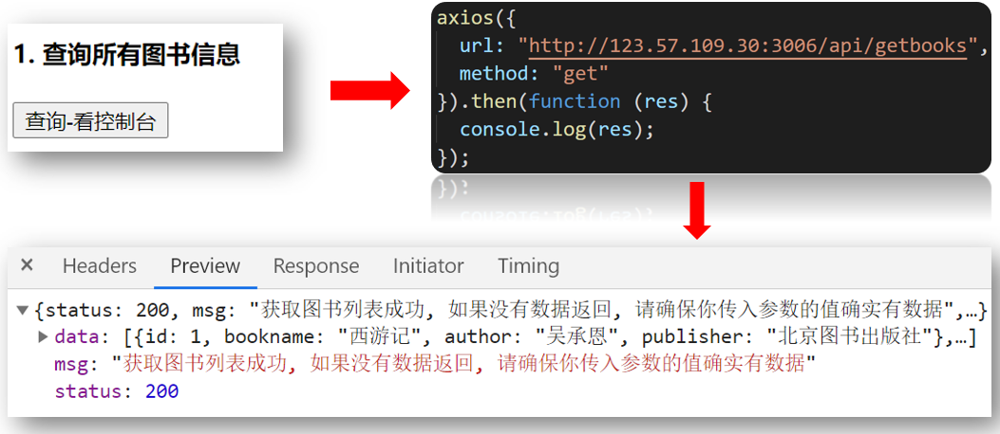
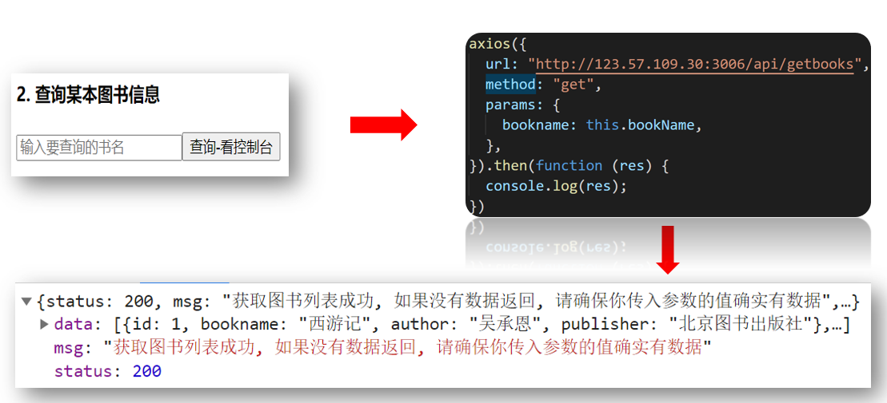

# axios基本使用

[axios文档](http://www.axios-js.com/)

特点

* 支持客户端发送Ajax请求
* 支持服务端Node.js发送请求
* 支持Promise相关用法
* 支持请求和响应的拦截器功能
* 自动转换JSON数据
* axios 底层还是原生js实现, 内部通过Promise封装的

axios的基本使用

```js
axios({
  method: '请求方式', // get post
  url: '请求地址',
  data: {    // 拼接到请求体的参数,  post请求的参数
    xxx: xxx,
  },
  params: {  // 拼接到请求行的参数, get请求的参数
   	xxx: xxx 
  }
}).then(res => {
  console.log(res.data) // 后台返回的结果
}).catch(err => {
  console.log(err) // 后台报错返回
})

```

------


## 1_axios基本使用-获取数据

> 目标: 调用文档最后_获取所有图书信息接口

功能: 点击调用后台接口, 拿到所有数据 – 打印到控制台

接口: 参考预习资料.md – 接口文档

引入: 下载axios, 引入后才能使用

效果:



例子如下:

components/UseAxios.vue

```vue
<template>
  <div>
    <p>1. 获取所有图书信息</p>
    <button @click="getAllFn">点击-查看控制台</button>
  </div>
</template>

<script>
// 目标1: 获取所有图书信息
// 1. 下载axios
// 2. 引入axios
// 3. 发起axios请求
import axios from "axios";
export default {
  methods: {
    getAllFn() {
      axios({
        url: "http://123.57.109.30:3006/api/getbooks",
        method: "GET", // 默认就是GET方式请求, 可以省略不写
      }).then((res) => {
        console.log(res);
      });
      // axios()-原地得到Promise对象
    },
  }
};
</script>
```

------


## 2_axios基本使用-传参

> 目标: 调用接口-获取某本书籍信息

功能: 点击调用后台接口, 查询用户想要的书籍信息 – 打印到控制台

接口: 参考预习资料.md – 接口文档

效果:



例子如下:

components/UseAxios.vue

```vue
<template>
  <div>
    <p>2. 查询某本书籍信息</p>
    <input type="text" placeholder="请输入要查询 的书名" v-model="bName" />
    <button @click="findFn">查询</button>
  </div>
</template>

<script>
import axios from "axios";
export default {
  data() {
    return {
      bName: ""
    };
  },
  methods: {
    // ...省略了查询所有的代码
    findFn() {
      axios({
        url: "/api/getbooks",
        method: "GET",
        params: { // 都会axios最终拼接到url?后面
            bookname: this.bName
        }
      }).then(res => {
          console.log(res);
      })
    }
  },
};
</script>
```

------


## 3_axios基本使用-发布书籍

> 目标: 完成发布书籍功能

功能: 点击新增按钮, 把用户输入的书籍信息, 传递给后台 – 把结果打印在控制台

接口: 参考预习资料.md – 接口文档

效果:


例子如下:

components/UseAxios.vue

```vue
<template>
  <div>
    <p>3. 新增图书信息</p>
    <div>
        <input type="text" placeholder="书名" v-model="bookObj.bookname">
    </div>
    <div>
        <input type="text" placeholder="作者" v-model="bookObj.author">
    </div>
    <div>
        <input type="text" placeholder="出版社" v-model="bookObj.publisher">
    </div>
    <button @click="sendFn">发布</button>
  </div>
</template>

<script>
import axios from "axios";
export default {
  data() {
    return {
      bName: "",
      bookObj: { // 参数名提前和后台的参数名对上-发送请求就不用再次对接了
          bookname: "",
          author: "",
          publisher: ""
      }
    };
  },
  methods: {
    // ...省略了其他代码
    sendFn(){
       axios({
           url: "/api/addbook",
           method: "POST",
           data: {
               appkey: "7250d3eb-18e1-41bc-8bb2-11483665535a",
               ...this.bookObj
            // 等同于下面
            // bookname: this.bookObj.bookname,
            // author: this.bookObj.author,
            // publisher: this.bookObj.publisher
           }
       }) 
    }
  },
};
</script>
```

------


## 4_axios基本使用-全局配置

> 目标: 避免前缀基地址, 暴露在逻辑页面里, 统一设置

```js
axios.defaults.baseURL = "http://123.57.109.30:3006"

// 所有请求的url前置可以去掉, 请求时, axios会自动拼接baseURL的地址在前面
getAllFn() {
    axios({
        url: "/api/getbooks",
        method: "GET", // 默认就是GET方式请求, 可以省略不写
    }).then((res) => {
        console.log(res);
    });
    // axios()-原地得到Promise对象
},
```

## 