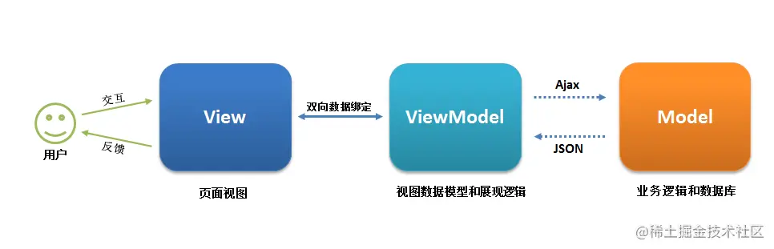

# Vue computed 和 watch 区别 ✅

## 1. 两者设计用途不同

- computed 用于产出二次处理之后的数据，如对于一个列表进行 filter 处理
- watch 用于监听数据变化（如 v-model 时，数据可能被动改变，需要监听才能拿到）

## 2. computed 有缓存

- computed 有缓存，data 不变则缓存不失效
- methods 无缓存，实时计算

## 3.运用场景

- 当我们需要进行数值计算，并且依赖于其它数据时，应该使用 computed，因为可以利用 computed 的缓存特性，避免每次获取值时，都要重新计算；

- 当我们需要在数据变化时执行异步或开销较大的操作时，应该使用 watch，使用 watch 选项允许我们执行异步操作 ( 访问一个 API )，限制我们执行该操作的频率，并在我们得到最终结果前，设置中间状态。这些都是计算属性无法做到的。

---


# Vuex中 mutation 和 action 区别 ✅

## 1.mutation

- 建议原子操作，每次只修改一个数据，不要贪多

- 必须是同步代码，方便查看 devTools 中的状态变化

## 2.action

- 可包含多个 mutation
- 可以是异步操作

## 3.`this.$store.state.xxx` 与 `mutation`的区别

- `this.$store.state.xxx` 能够改变数据
- 原因：vuex本身就是一个vue的实例、一个vue的全局组件。看源码（`$root.data`）。

## 4.module中命名空间属性

namespace防止不同module之间的数据混乱

------


# 说说你对 SPA 单页面的理解，它的优缺点分别是什么？✅

## SPA简介

SPA（ single-page application ）仅在 Web 页面初始化时加载相应的 HTML、JavaScript 和 CSS。一旦页面加载完成，SPA 不会因为用户的操作而进行页面的重新加载或跳转；取而代之的是利用路由机制实现 HTML 内容的变换，UI 与用户的交互，避免页面的重新加载。

## 优点

- 用户体验好、快，内容的改变不需要重新加载整个页面，避免了不必要的跳转和重复渲染；
- 基于上面一点，SPA 相对对服务器压力小；
- 前后端职责分离，架构清晰，前端进行交互逻辑，后端负责数据处理；

## 缺点

- 初次加载耗时多：为实现单页 Web 应用功能及显示效果，需要在加载页面的时候将 JavaScript、CSS 统一加载，部分页面按需加载；
- 前进后退路由管理：由于单页应用在一个页面中显示所有的内容，所以不能使用浏览器的前进后退功能，所有的页面切换需要自己建立堆栈管理；
- SEO 难度较大：由于所有的内容都在一个页面中动态替换显示，所以在 SEO 上其有着天然的弱势。

------


# v-show 与 v-if 有什么区别？✅

​	**v-if** 是**真正**的条件渲染，因为它会确保在切换过程中条件块内的事件监听器和子组件适当地被销毁和重建；也是**惰性的**：如果在初始渲染时条件为假，则什么也不做——直到条件第一次变为真时，才会开始渲染条件块。

​	**v-show** 就简单得多——不管初始条件是什么，元素总是会被渲染，并且只是简单地基于 CSS 的 “display” 属性进行切换。

​	所以，v-if 适用于在运行时很少改变条件，不需要频繁切换条件的场景；v-show 则适用于需要非常频繁切换条件的场景。

------


# Class 与 Style 如何动态绑定？✅

## class的动态绑定

方法一：通过对象绑定

```js
<div v-bind:class="{ 'active': isActive, 'text-danger': hasError }"></div>

data: {
  isActive: true,
  hasError: false
}
```

方法二：通过数组绑定

```js
<div v-bind:class="[isActive ? activeClass : '', errorClass]"></div>

data: {
  activeClass: 'active',
  errorClass: 'text-danger'
}
```


## style的动态绑定

方法一：对象绑定

```js
<div v-bind:style="{ color: activeColor, fontSize: fontSize + 'px' }"></div>

data: {
  activeColor: 'red',
  fontSize: 30
}
```

方法二：数组绑定

```js
<div v-bind:style="[styleColor, styleSize]"></div>

data: {
  styleColor: {
     color: 'red'
   },
  styleSize:{
     fontSize:'23px'
  }
}
```

------


# 谈一下你对Vue的生命周期的理解？✅

1. 生命周期是什么？

   Vue 实例有一个完整的生命周期，也就是从开始创建、初始化数据、编译模版、挂载 Dom -> 渲染、更新 -> 渲染、卸载等一系列过程，我们称这是 Vue 的生命周期。

   

2. 生命周期有几个阶段及其作用？

| 生命周期 | 描述                                                         |
| -------- | ------------------------------------------------------------ |
|          | 组件实例被创建之初，组件的属性生效之前                       |
|          | 组件实例已经完全创建，属性也绑定，但真实 dom 还没有生成，$el 还不可用 |
|          | 在挂载开始之前被调用：相关的 render 函数首次被调用           |
|          | el 被新创建的 vm.$el 替换，并挂载到实例上去之后调用该钩子    |
|          | 组件数据更新之前调用，发生在虚拟 DOM 打补丁之前              |
|          | 组件数据更新之后                                             |
|          | keep-alive 专属，组件被激活时调用                            |
|          | keep-alive 专属，组件被销毁时调用                            |
|          | 组件销毁前调用                                               |
|          | 组件销毁后调用                                               |


3. 图解


------


# Vue 的父组件和子组件生命周期钩子函数执行顺序？✅

- 加载渲染过程
  - 父组件beforeCreate -> 父组件created -> 父组件beforeMount ->子组件beforeCreate -> 子组件created ->子组件beforeMount -> 子组件mounted -> 父组件mounted
- 子组件更新过程
  - 父组件beforeUpdate -> 子组件beforeUpdate ->子组件updated -> 父组件updated
- 父组件更新过程
  - 父组件beforeUpdate -> 父组件updated
- 销毁过程
  - 父组件beforeDestroy -> 子组件beforeDestroy ->子组件destroyed -> 父组件destroyed

------


# 在哪个生命周期内调用异步请求？✅

​	可以在钩子函数 created、beforeMount、mounted 中进行调用，因为在这三个钩子函数中，data 已经创建，可以将服务端端返回的数据进行赋值。但是本人推荐在 created 钩子函数中调用异步请求，因为在 created 钩子函数中调用异步请求有以下优点：

- 能更快获取到服务端数据，减少页面 loading 时间；
- ssr 不支持 beforeMount 、mounted 钩子函数，所以放在 created 中有助于一致性；

------


# 哪个生命周期可以获取DOM元素？✅

在钩子函数 mounted 被调用前，Vue 已经将编译好的模板挂载到页面上，所以在 mounted 中可以访问操作 DOM。

------


# 怎么理解Vue的单向数据流？✅

​	所有的 prop 都使得其父子 prop 之间形成了一个**单向下行绑定**：父级 prop 的更新会向下流动到子组件中，但是反过来则不行。这样会防止从子组件意外改变父级组件的状态，从而导致你的应用的数据流向难以理解。

​	额外的，每次父级组件发生更新时，子组件中所有的 prop 都将会刷新为最新的值。这意味着你不应该在一个子组件内部改变 prop。如果你这样做了，Vue 会在浏览器的控制台中发出警告。子组件想修改时，只能通过 $emit 派发一个自定义事件，父组件接收到后，由父组件修改。

有两种常见的试图改变一个 prop 的情形 :

- **这个 prop 用来传递一个初始值；这个子组件接下来希望将其作为一个本地的 prop 数据来使用。** 在这种情况下，最好定义一个本地的 data 属性并将这个 prop 用作其初始值：

```js
//方法一：通过data直接处理
props: ['initialCounter'],
data: function () {
  return {
    counter: this.initialCounter
  }
}
```

- **这个 prop 以一种原始的值传入且需要进行转换。** 在这种情况下，最好使用这个 prop 的值来定义一个计算属性

```js
//方法二：利用computed属性进行处理
props: ['size'],
computed: {
  normalizedSize: function () {
    return this.size.trim().toLowerCase()
  }
}
```

------


# 直接给一个数组项赋值，Vue 能检测到变化吗？【❌】

------


# 父组件可以监听到子组件的生命周期吗？✅（09.05）

方法一：通过 $emit 触发父组件的事件

```js
// Parent.vue
<Child @mounted="doSomething"/>
    
// Child.vue
mounted() {
  this.$emit("mounted");
}
```


方法二：通过 @hook 监听

>  @hook 方法不仅仅是可以监听 mounted，其它的生命周期事件，例如：created，updated 等都可以监听。

```js
//  Parent.vue
<Child @hook:mounted="doSomething" ></Child>

doSomething() {
   console.log('父组件监听到 mounted 钩子函数 ...');
},
    
//  Child.vue
mounted(){
   console.log('子组件触发 mounted 钩子函数 ...');
},    
    
// 以上输出顺序为：
// 子组件触发 mounted 钩子函数 ...
// 父组件监听到 mounted 钩子函数 ...   
```


## 拓展：程序化的事件侦听器

除了 `$emit` 的用法，它可以被 `v-on`监听到，还有其他的方法

- 通过 `$on(eventName, eventHandler)` 侦听一个事件
- 通过 `$once(eventName, eventHandler)` 一次性侦听一个事件
- 通过 `$off(eventName, eventHandler)` 停止侦听一个事件

应用场景一：

在vue组件中使用了定时器，组件销毁时必须要清楚定时器，以防内存泄漏。

```js
//做法一
<script>
  export default {
    mounted() {
      this.timer = setInterval(() => { ... }, 1000);
    },
    beforeDestroy() {
      clearInterval(this.timer);
    }
  };
</script>

//做法二（代码优化）
<script>
  export default {
    mounted() {
      const timer = setInterval(() => { ... }, 1000);
      this.$once('hook:beforeDestroy', () => clearInterval(timer);)
    }
  };
</script>
```

应用场景二：

一个页面里需要加载一个可视化组件，这个组件里面的逻辑极其复杂，存在大量复杂的计算。复杂到什么程度呢？就是从页面开始计算到计算完毕大概需要 1s。而且这个时间也是随着数据的多少而变化。 而且这个组件是一个已经离职的同时开发的，里面用到了多个 worker 协助计算，因为属于纯可视化组件，里面只有一个 canvas。因为考虑可能要在多个地方使用，就并没有引入主题相关的 loading。我们的需求是什么呢？

就是在数据渲染到页面的之前让页面 loading。mounted 之后停止 loading。beforeUpdata 时开始 loading。updatad 之后停止 loading。

最简单的方法就是改写组件的生命周期函数，使其在 mounted/beforeUpdata /updatad 时通知父组件显示或者隐藏 loading。

这样做显示不好，因为侵入了自组件的逻辑，增加的逻辑也和组件本身的功能好不关联。最好的办法就是使用 v-on="hook:xxx" 的方式：

```js
<v-chart
    @hook:mounted="loading = false"
    @hook:beforeUpdated="loading = true"
    @hook:updated="loading = false"
    :data="data"
/>
```


# 谈谈你对 keep-alive 的了解？✅

keep-alive 是 Vue 内置的一个组件，可以使被包含的组件保留状态，避免重新渲染 ，其有以下特性：

- 一般结合路由和动态组件一起使用，用于缓存组件；
- 提供 include 和 exclude 属性，两者都支持字符串或正则表达式， include 表示只有名称匹配的组件会被缓存，exclude 表示任何名称匹配的组件都不会被缓存 ，其中 exclude 的优先级比 include 高；
- 对应两个钩子函数 activated 和 deactivated ，当组件被激活时，触发钩子函数 activated，当组件被移除时，触发钩子函数 deactivated。


# vue 为什么要销毁第三方实例？❌


# 组件中的data为什么是个函数？✅

> 为什么组件中的 data 必须是一个函数，然后 return 一个对象，而 new Vue 实例里，data 可以直接是一个对象？

```js
// data
data() {
  return {
    message: "子组件",
    childName:this.name
  }
}

// new Vue
new Vue({
  el: '#app',
  router,
  template: '<App/>',
  components: {App}
})
```

因为组件是用来复用的，且 JS 里对象是引用关系，如果组件中 data 是一个对象，那么这样作用域没有隔离，子组件中的 data 属性值会相互影响，如果组件中 data 选项是一个函数，那么每个实例可以维护一份被返回对象的独立的拷贝，组件实例之间的 data 属性值不会互相影响。

new Vue 的实例，是不会被复用的，因此不存在引用对象的问题。

------


# v-model 的原理？✅

我们在 vue 项目中主要使用 v-model 指令在表单 input、textarea、select 等元素上创建双向数据绑定，我们知道 v-model 本质上不过是语法糖，v-model 在内部为不同的输入元素使用不同的属性并抛出不同的事件：

- text 和 textarea 元素使用 value 属性和 input 事件；
- checkbox 和 radio 使用 checked 属性和 change 事件；
- select 字段将 value 作为 prop 并将 change 作为事件。

以 input  表单元素为例：

```js
<input v-model='something'>
    
相当于

<input v-bind:value="something" v-on:input="something = $event.target.value">
复制代码
```

如果在自定义组件中，v-model 默认会利用名为 value 的 prop 和名为 input 的事件，如下所示：

```javascript
父组件：
<ModelChild v-model="message"></ModelChild>

子组件：
<div>{{value}}</div>

props:{
    value: String
},
methods: {
  test1(){
     this.$emit('input', '小红')
  },
},
```

------


# 什么是MVVM？✅

​	Model–View–ViewModel （MVVM） 是一个软件架构设计模式，MVVM 源自于经典的 Model–View–Controller（MVC）模式  ，MVVM 的出现促进了前端开发与后端业务逻辑的分离，极大地提高了开发效率。

​	MVVM 的核心是 ViewModel 层，它就像是一个中转站（value converter），负责转换 Model 中的数据对象来让数据变得更容易管理和使用，该层向上与视图层进行双向数据绑定，向下与 Model 层通过接口请求进行数据交互，起呈上启下作用。如下图所示：



代码解析：

1）View 层

```xml
<div id="app">
    <p>{{message}}</p>
    <button v-on:click="showMessage()">Click me</button>
</div>
```

（2）ViewModel 层

```javascript
var app = new Vue({
    el: '#app',
    data: {  // 用于描述视图状态   
        message: 'Hello Vue!', 
    },
    methods: {  // 用于描述视图行为  
        showMessage(){
            let vm = this;
            alert(vm.message);
        }
    },
    created(){
        let vm = this;
        // Ajax 获取 Model 层的数据
        ajax({
            url: '/your/server/data/api',
            success(res){
                vm.message = res;
            }
        });
    }
})
```

（3） Model 层

```json
{
    "url": "/your/server/data/api",
    "res": {
        "success": true,
        "name": "IoveC",
        "domain": "www.cnblogs.com"
    }
}
```

------


