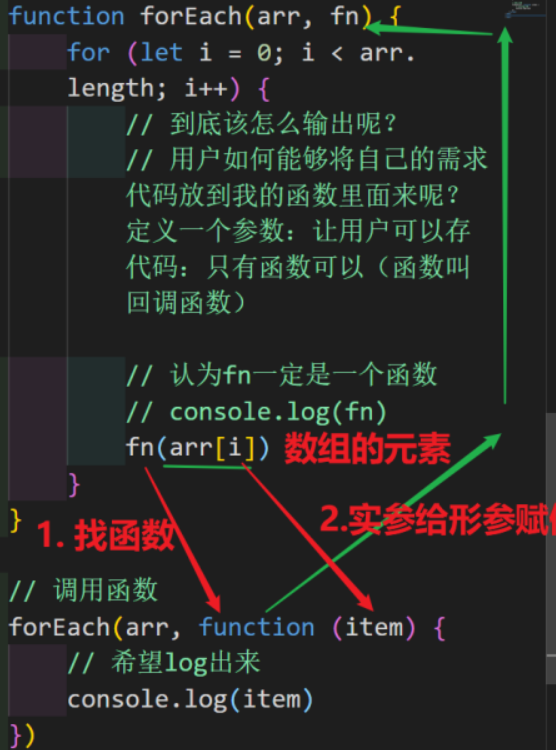
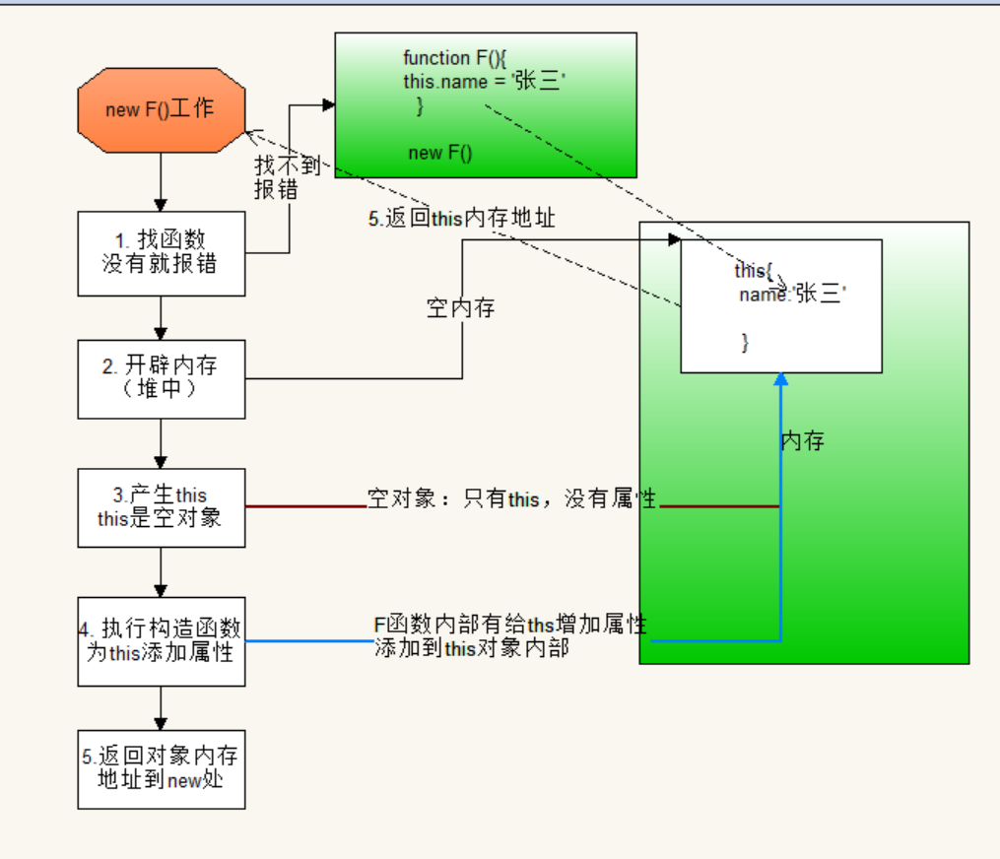
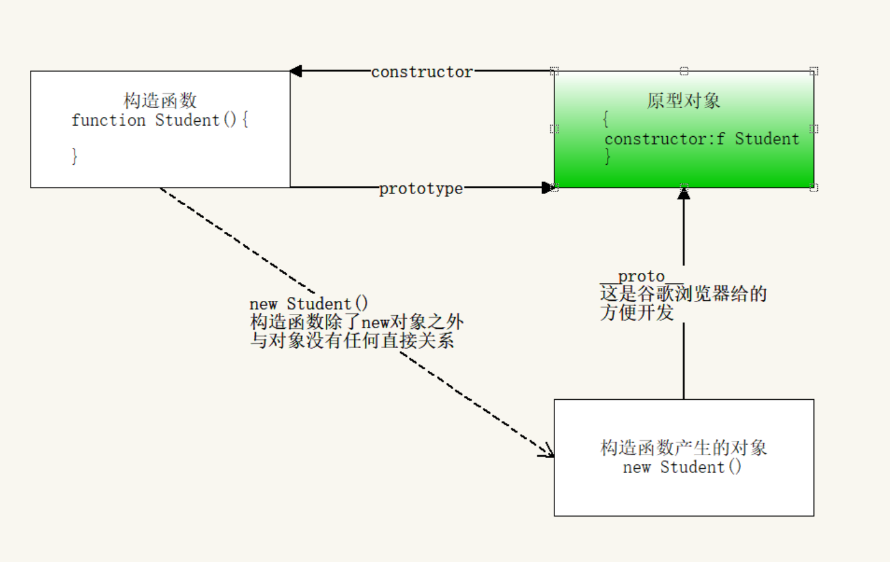
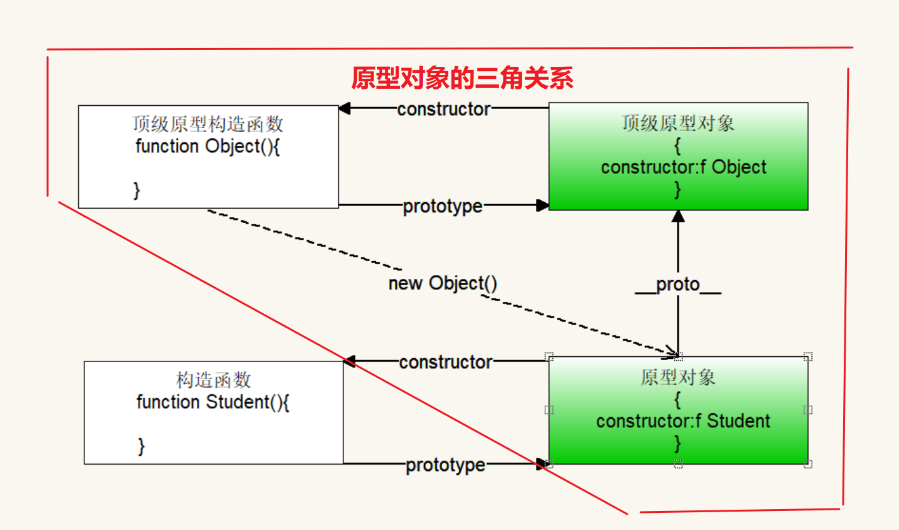
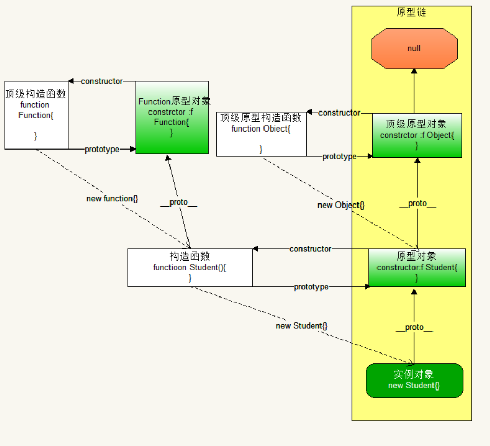

## 对象 Object

### 对象的遍历

1. 对象为什么不能使用简单for循环遍历？

   【答】：对象没有有规则的下标，无法动态生成下标（数字可以：下标从0开始，连续变化）

2. 对象遍历的方法：`for...in...`

   - 注意：

     1. 在`for...in..`中不能使用点语法。即：`对象.key` 访问的是对象中属性的名字叫做key的属性。
     1. 在`for...in..`中不能使用`obj['key']`，即：如果中括号里面的内容是一个字符串：**不会解析 obj['key'] === obj.key**
     1. 数组也可以使用for-in进行遍历，因为数组是特殊的对象。

   - 代码展示
   
     ```js
     let obj = {
         name:'安其拉',
         age:18,
         gender:'女',
         skill:'扔个球'
     }
     
     for(let key in obj){
         console.log(obj.key) //underfind
         console.log(obj[key]) //正常打印
     }
     ```


### 内部对象this

1. 定义函数时（箭头函数除外），里面会产生一个变量this

2. this的指向：谁调用函数，this就指向谁。

3. 在对象内部的属性访问（包括对象内部的函数），必须要通过对象来访问

   - 正确访问：`对象名.属性名`（弊端：万一对象的名字发生了修改，内部代码也要跟着修改）
   - 标准访问：`this.属性名`

4. 扩展---普通函数里面的this代表谁？

   【答】window对象

- 代码展示：

```js
let obj = {
    name:'安其拉',
    age:18,
    gender:'女',
    skill:'扔个球'，
    cplay: function () {
		console.log(obj.name) //安其拉
		console.log(this.name) //安其拉
		console.log(this.cplay); //打印了这个函数
		console.log(`${this.name} 正在 ${this.skill}`)  // 安其拉正在扔个球。
    }
}
```

### 注意要点

- 对象的属性名可以是数字（系统会把数字转成字符串），也可以有引号。
- 如果对象的属性名是数字：访问不能使用对象专属语法：`.语法`。
- 用数组访问属性名是数字时，可以加引号也可以不加（系统会自动转成字符串）【为了统一加上】


## 普通函数

### arguement

> 简介：
>
> - arguments是伪数组：有length，也有下标。
> - arguments里面的数据是所有的实参。

应用场景：不确定实参的数量。比如比较大小，排序等...

- 代码演示：

```js
函数：求用户传入所有数据的最大值
function max() {
	// 求极值：擂台思想
	let m = -Infinity

	// 所有实参都在arguments存着
	for (let i = 0; i < arguments.length; i++) {
	// 判定
		if (arguments[i] > m) {
			m = arguments[i]
		}
	}
	return m
}
```

### 自执行函数

1. 本质：不是函数真的自动执行；而是在定义的函数外部套一层函数，并且调用函数。
2. 目的：为了保证数据安全，不给用户修改。将保存数据的变量放到函数的内部定义。
3. 使用：
   - 语法：` ( function(   ){   } )  (   )` 
   - 第一个`(  ) `定义结构，第二个`(  ) `调用函数。
4. 自执行函数`(  )(  )`：里面的函数会自动运行，只能运行1次。
5. 如果使用了自执行函数：保证上一条语句必须有分号 （结束符）。
6. 同名的变量可以反复定义和使用，彼此不冲突。
7. 实际开发中，如果是函数要复用的话，一定不能放在自执行中：其他地方调用不了。
8. 沙箱操作。

- 代码展示

```js
版本①：用户可以通过控制面板改变更改数据。
//定义声明：全局的，不安全，用户可以在外面动态的随时修改
let lives = 10
// 点击按钮：命就少一条
document.querySelector('button').onclick = function () {
    // 减少声明
    lives--

    // 保证安全
    if (lives < 0) {
        alert('Game over')
        return      // 终止函数运行
    }
    console.log('游戏开始了，还剩' + lives + '条命')
}; 

版本②：自执行函数
(function () {
    // 将要保护安全的代码，放到当前位置
    let lives = 10
    // 点击按钮：命就少一条
    document.querySelector('button').onclick = function () {
        // 减少声明
        lives--

        // 保证安全
        if (lives < 0) {
            alert('Game over')
            return      // 终止函数运行
        }
        console.log('游戏开始了，还剩' + lives + '条命')
    };
})()
```

### 回调函数

定义：形参接收的数据是一个外部的函数，在函数的内部（形参所在函数：主函数）可以通过`( )`来执行外部函数

扩展：在实际开发中，回调函数一般都不会提前写好，直接在调用函数的时候写。

使用场景：

	1. 数组：数组遍历是共用代码（数组对象有一个内置函数：forEach）
	1.  动画（WebAPI：定时器）：涉及到先后顺序的问题

代码运行图解：



> 注意：
>
> - 主函数中，外部函数作为实参传入时不要加上`（ ）`。

代码展示

```js
// 定义主函数
function fn(item) {
    console.log(item);
}
// 定义另外的函数
let test = function () {
    console.log('我是test函数')
}
// test作为回调函数传入主函数中
fn(test) ✔

//将test()先运行得到结果：返回值undefined，再把undefined赋值给fn
fn(test()) ❌
```

## 构造函数

### 定义

ES5为了实现面向对象，而特意创建一种方便产生对象的特殊函数。

### 特点

- 函数名是大驼峰。
- 函数里面会大量使用`this`，代表对象。
- 函数里面不需要返回值return。
- 调用函数`new 函数名()`（new是用来实例化（产生）对象的）

### new的工作原理

1. 找到对应的构造函数：如果找不到会报错。
2. 在堆（内存）中分配一块内存地址。
3. 产生了一个this对象（内部对象）：空对象。
4. 执行函数：函数里面的this就是上述的this

图解：



代码演示：

```js
// 创建学生：姓名、性别、年龄
function Student(name, age, gender) {
    // 重点：参数都是给属性用的，为属性赋值，用this
    this.name = name
    this.age = age
    this.gender = gender
}

// 调用构造函数
const s1 = new Student('王昭君', 18, '女')
console.log(s1) //Student {name: '王昭君', age: 18, gender: '女'}

// 创建老师：姓名、性别、年龄
function Teacher(name, age, gender) {
    this.name = name
    this.age = age
    this.gender = gender
}

const t1 = new Teacher('鬼谷子', 80, '男')
console.log(t1) //Teacher {name: '鬼谷子', age: 80, gender: '男'}
```

### 普通函数与构造函数的差异

- 普通函数
  1. 函数体中的`this`指向window对象
  2. 调用函数使用`（）`
  3. 需要有返回值。
- 构造函数
  1. 函数体中的`this`指向新的对象。
  2. 调用函数使用`new`。
  3. 构造函数可以有返回值：但是返回值如果是基础数据类型，返回值无效。只能返回复合数据类型，并且会修改构造函数默认的返回值（对象自己）【构造函数本身的目的就是为了区分对象，返回值修改了别的对象，构造函数就失去了意义】

### 属性方法

> 在构造函数中，为属性增加了方法，不会产生任何区别：new的原理没有变化

注意：

- 普通数据属性：直接使用。`例如：s1.study`
- 构造函数中的方法，需要+`（）`。`例如：s1.study()`

> 缺点：个对象需要占据一块内存来存储同一个函数study：产生的结果是，对象越多，内存的占用越多。
>
> 解决方法：把构造函数的方法，写在构造函数外面。但存在安全隐患，可以被覆盖

## 原型对象 prototype

### 简介

1. 定义：在js中：只要定义一个函数（普通函数还是构造函数），系统就会立马产生一个原型对象。

2. 原型对象（妻子）中，必有一个属性（系统给的）constructor，保存的是自己对应的构造函数（丈夫）。两者是一对一的关系，彼此都可以找到对方。
3. 原型本质是一个对象，理解为 JavaScript 自动帮我们添加的。

### 应用场景

原型对象中保存函数：

1. 所有的对象都可以访问，只有一份内存：节省内存。
2. 方法存在对象内部：块级作用域，不是全局就不会被污染：安全

### 三者关系的图解




### 定义函数的三种方式

> 一：有名函数
>
> 特点：由于变量提升，调用函数可以在定义函数的前后使用都可以。
>
> 代码展示：
>
> ```js
> f1()
> function f1() {
>     console.log('我是有名函数')
> }
> f1()
> ```

> 二：函数表达式
>
> 特点：只能先定义后调用
>
> 代码展示：
>
> ```js
> let f2 = function () {
>     console.log('我是函数表达式')
> }
> f2()
> ```

> 三：顶级构造函数Function
>
> 简介：
>
> 1. 所有的函数，不管什么方式定义的，有名的还是匿名的，最终都是由Function顶级构造函数定义的。手动只能产生匿名函数。
> 2. Function是一个系统函数（不要去覆盖，不用定义同名函数）
> 3. 我们实际开发只要用`function 函数名( ){}`，系统如何操作不用管
>
> 使用语法：
>
> ​	`new Function(参数列表)`
>
> 参数特点：
>
> 	1. 所有参数：都必须使用引号包裹
> 	1. 最后一个参数：里面的内容是函数体
>
> 代码展示：
>
> ```js
> const f = new Function('a', 'b', 'console.log(a+b)')
> console.log( f) // 是一个函数：两个形参（a和b），函数体为console.log(a+b)
>                     /**
>                     ƒ anonymous(a,b) {
>                     	console.log(a+b)
>                     }
>                     */
> ```

### 原型对象的由来

定义：构造函数由Function构造函数得到，原型对象由Object构造函数产生。

注意：Object的原型对象是顶级原型对象，是所有自定义构造函数原型对象（只考虑一层）的原型的上级。而Object.prototype 原型对象是顶级原型，没有上级，是`null`。

图解：



### 原型链

#### 作用

1. 实现代码的复用（ES5中的面向对象特性：继承）
   - 解析：实例化对象 继承 原型对象 继承 顶级原型对象，下面的对象可以访问上面原型对象里面的任何内容
2. 构造函数中属性是方法：方法会存到原型对象中。安全，节省占用空间。

> 注意事项：
>
> 1. 不是所有的方法都应该往顶级原型对象中添加（实际开发中，都不会给顶级原型对象添加任何原型方法。
> 2. 给自定义构造函数的原型对象添加（不破坏原有的结构）

#### 图解




## 箭头函数

### 简介

1. 箭头函数是一种结构的变化：`(  )=>{  }`，用来简化匿名函数。
2. 用`=>`代替了的`function`关键字

### 简写

1. 如果形参 只有一个 ，可以省略形参的小括号`(  )`
2. 如果函数体只有 一行代码，可以省略`{ }`
3. 如果省略了`{  }（只有一行函数体）`，不能使用`return`，因为自带`return（省略大括号自带return）`。


