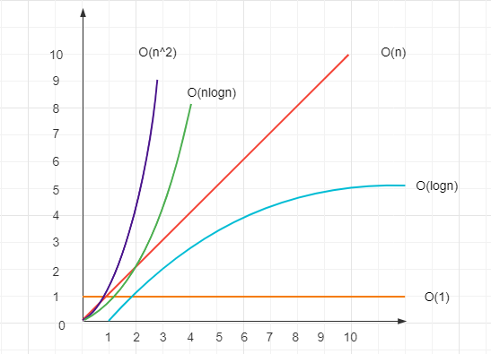
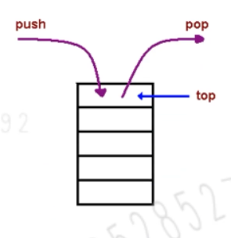
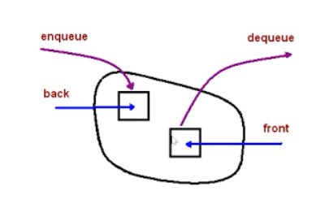
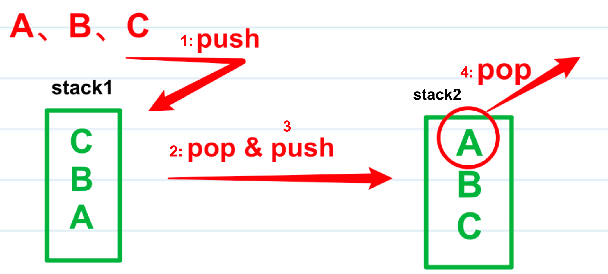

### 「算法复杂度」

- 什么是复杂度？

  - 程序执行时需要的**计算量**和**内存空间**（和代码是否简介无关）

  - 复杂度是**数量级**（方便记忆、推广），不是具体的数字

  - 一般针对一个具体的算法，而非一个完整的系统

    

- 时间复杂度 - 考察程序执行时需要的计算量

  - 

  - 程序执行时需要的计算量（cpu）

    > O(1)：计算量和输入量无关，一次就够（数量级）
    >
    > O(n)：计算量和传输的数据量一样（数量级）
    >
    > O(n^2)：计算量是输入量的平方（数据量）
    >
    > O(logn)：输入量越多，计算量越平稳。
    >
    > O(nlogn)：输入量越多，计算量越大

  - 代码演示

    ```js
    //O(1)
    function fn(obj = {}){
      return obj.a + obj.b + obj.c
    }
    
    //O(n)
    function fn(arr = []){
      //遍历一次
      for(let j =0; j<arr.length; j++){
        console.info(arr[j])
      }
    }
    
    //O(n^2)
    function fn(arr = []){
      for(let j =0; j<arr.length; j++){
        for(let i =0; i<arr.length; i++){
          console.info(arr[i])
        }
      }
    }
    
    //O(logn)--二分法和递归
    略
    
    //O(nlogn)----一次循环+一次二分
    ```
    
    

- 空间复杂度 - 考察程序执行时需要的内存空间

  - 程序执行时需要的内存空间

    > O(1)：有限的、可数的空间（数量级）
    > 
    > O(n)：和输入的数据量相同的空间（数量级）
    > 
    > O(n^2)：
    > 
    > O(logn)：
    > 
    > O(nlogn)：
    
    

  - 代码演示

    ```js
    //O(1)
    function fn(arr = []){
      const a = arr[1]
      const b = arr[2]
    }
    
    //O(n)
    function fn(arr = []){
      const arr2 = []
      for(let i =0; i<arr.length; i++){
          arr2[i] = arr[i] + 10 
        }
    }
    ```
    
    

### 「栈（Stack）」

#### 简介

- 栈是一个`后进先出`的结构。
- 对应到数组的方法，刚好就是 push 和 pop。因此，我们可以认为在 JavaScript 中，栈就是限制只能用 push 来添加元素，同时只能用 pop 来移除元素的一种特殊的数组。
- 如图所示
  - 


#### 栈和数组的区别

栈：逻辑结构。理论模型，不管如何实现，不受任何语言的限制。

数组：物理结构。真是的功能实现，受限于编程语言。


### 「队列（Queue）」

简介：

- 队列是一个`先进先出`的数据结构
- 对应到数组的方法，刚好就是数组的 push 和 shift 方法。
- 队列是逻辑结构，抽象模型
  - 简单的队列，可以用数组、链表实现。
  - 复杂的队列服务，需要单独设计。
- 如图所示
  - 


### 「记录模版」

#### 题目描述


#### 实现思路


#### 代码演示

##### 主题代码

```typescript

```


##### 功能测试

```typescript

```


##### 单元测试

```typescript

```


##### 性能测试

> 略


##### 复杂度测试

- 时间复杂度
- 空间复杂度


### 「将一个数组旋转k步」

#### 题目描述

 1. 输入一个数组 `[1,2,3,4,5,6,7]`
 2. k=3，即旋转3步
 3. 输出 `[5,6,7,1,2,3,4]`


#### 实现思路

- 思路1：把末尾的元素挨个pop，然后unshift到数组前面。
- 思路2：把数组拆分，最后concat拼接到一起。


#### 代码演示

##### 思路1

###### 主体代码

```typescript
function rotate1(arr: number[], k: number): number[] {
    const length = arr.length
    if (!k || length === 0) return arr
    const step = Math.abs(k % length) // abs 取绝对值
    for (let i = 0; i < step; i++) {
        const n = arr.pop()
        if (n != null) {
            arr.unshift(n) // 数组是一个有序结构，unshift 操作非常慢！！！ O(n)
        }
    }
    return arr
}
```


###### 功能测试

```typescript
const arr = [1, 2, 3, 4, 5, 6, 7]
const arr1 = rotate1(arr, 3)
console.info(arr1) // [5,6,7,1,2,3,4]
```


###### 单元测试

```typescript
describe('数组旋转', () => {
    it('正常情况', () => {
        const arr = [1, 2, 3, 4, 5, 6, 7]
        const k = 3

        const res = rotate1(arr, k)
        expect(res).toEqual([5, 6, 7, 1, 2, 3, 4]) // 断言
    })

    it('数组为空', () => {
        const res = rotate1([], 3)
        expect(res).toEqual([]) // 断言
    })

    it('k 是负值', () => {
        const arr = [1, 2, 3, 4, 5, 6, 7]
        const k = -3

        const res = rotate1(arr, k)
        expect(res).toEqual([5, 6, 7, 1, 2, 3, 4]) // 断言
    })

    it('k 是 0',  () => {
        const arr = [1, 2, 3, 4, 5, 6, 7]
        const k = 0

        const res = rotate1(arr, k)
        expect(res).toEqual(arr) // 断言
    })

    it('k 不是数字', () => {
        const arr = [1, 2, 3, 4, 5, 6, 7]
        const k = 'abc'

        // @ts-ignore
        const res = rotate1(arr, k)
        expect(res).toEqual(arr) // 断言
    })
})
```


###### 性能测试

```typescript
const arr1 = []
for (let i = 0; i < 10 * 10000; i++) {
    arr1.push(i)
}
console.time('rotate1')
rotate1(arr1, 9 * 10000)
console.timeEnd('rotate1') // 885ms O(n^2)
```


###### 复杂度分析

- 时间复杂度：O(n^2)
  - for循环为O(n)，unshift也为O(n)，但是unshift在for循环里面，所以整体为O(n^2)。
  - 关于数组方法的时间复杂度
    - 数组是一个连续的、有序的结构
    - 其中`unshift`、`shift`、`splice`方法的时间复杂度都是O(n)，因为都改变了数组的内部结构。
- 空间复杂度：O(1)


##### 思路2

###### 主体代码

```typescript
function rotate2(arr: number[], k: number): number[] {
    const length = arr.length
    if (!k || length === 0) return arr
    const step = Math.abs(k % length) // abs 取绝对值

    // O(1)
    const part1 = arr.slice(-step) // O(1)
    const part2 = arr.slice(0, length - step)
    const part3 = part1.concat(part2)
    return part3
}
```


###### 功能测试

> 同上


###### 单元测试

> 同上


###### 性能测试

```typescript
const arr2 = []
for (let i = 0; i < 10 * 10000; i++) {
    arr2.push(i)
}
console.time('rotate2')
rotate2(arr2, 9 * 10000)
console.timeEnd('rotate2') // 1ms O(1)
```


###### 复杂度分析

- 时间复杂度
  - 不存在遍历，所以整体为O(1)
- 空间复杂度
  - 在函数体中产生了两个数组，所以空间复杂度为O(2n)，即为O(n)。


### 「判断一个字符串是否括号匹配」

#### 题目描述

给定一个包含 '('，')'，'{'，'}'，'['，']' 的字符串，判断字符串是否有效。

有效字符串需满足：

- 左括号必须用相同类型的右括号闭合。
- 左括号必须以正确的顺序闭合。


#### 实现思路

1. 对于没有闭合的左括号而言，越靠后的左括号，对应的右括号越靠前。
2. 满足后进先出，考虑用栈。


#### 代码演示

##### 主题代码

步骤：

1. 新建一个栈。
2. 扫描字符串，与左括号入栈，遇到和栈顶括号类型匹配的右括号就出栈，类型比匹配直接判断不合法
3. 最后栈空了就合法。

```typescript
/**
 * 判断左右括号是否匹配
 * @param left 左括号
 * @param right 右括号
 */
function isMatch(left: string, right: string): boolean {
    if (left === '{' && right === '}') return true
    if (left === '[' && right === ']') return true
    if (left === '(' && right === ')') return true
    return false
}

/**
 * 判断是否括号匹配
 * @param str str
 */
function matchBracket(str: string): boolean {
    const length = str.length
    if (length === 0) return true

    const stack = []

    const leftSymbols = '{[('
    const rightSymbols = '}])'

    for (let i = 0; i < length; i++) {
        const s = str[i]

        if (leftSymbols.includes(s)) {
            // 左括号，压栈
            stack.push(s)
        } else if (rightSymbols.includes(s)) {
            // 右括号，判断栈顶（是否出栈）
            const top = stack[stack.length - 1]
            if (isMatch(top, s)) {
                stack.pop()
            } else {
                return false
            }
        }
    }

    return stack.length === 0
}
```


##### 功能测试

```typescript
const str = '{a(b[c]d)e}f'
console.info(123123, matchBracket(str)) //true
```


##### 单元测试

```typescript
describe('括号匹配', () => {
    it('正常情况', () => {
        const str = '{a(b[c]d)e}f'
        const res = matchBracket(str)
        expect(res).toBe(true)
    })

    it('不匹配', () => {
        const str = '{a(b[(c]d)e}f'
        const res = matchBracket(str)
        expect(res).toBe(false)
    })

    it('顺序不一致的', () => {
        const str = '{a(b[c]d}e)f'
        const res = matchBracket(str)
        expect(res).toBe(false)
    })

    it('空字符串', () => {
        const res = matchBracket('')
        expect(res).toBe(true)
    })
})
```


##### 性能测试

> 略


##### 复杂度分析

- 时间复杂度：O(n)
- 空间复杂度：O(n)


### 「两个栈实现一个队列」

#### 题目描述

- 请用两个栈，实现一个队列
- 功能 add、delete、length


#### 实现思路

1. add功能：直接push到栈1（stack1）中。
2. delete功能
   - 栈1（stack1）中的数据通过pop方法拿出来，再通过push方法转移到栈2（stack2）中
   - 然后，栈2（stack2）通过pop方法拿出来
   - 图解
     - 


#### 代码演示

##### 主题代码

```typescript
class MyQueue {
    private stack1: number[] = []
    private stack2: number[] = []

    /**
     * 入队
     * @param n n
     */
    add(n: number) {
        this.stack1.push(n)
    }

    /**
     * 出队
     */
    delete(): number | null {
        let res

        const stack1 = this.stack1
        const stack2 = this.stack2

        // 将 stack1 所有元素移动到 stack2 中
        while(stack1.length) {
            const n = stack1.pop()
            if (n != null) {
                stack2.push(n)
            }
        }

        // stack2 pop
        res = stack2.pop()

        // 将 stack2 所有元素“还给”stack1
        while(stack2.length) {
            const n = stack2.pop()
            if (n != null) {
                stack1.push(n)
            }
        }
      
        return res || null
    }

    get length(): number {
        return this.stack1.length
    }
}
```


##### 功能测试

```typescript
const q = new MyQueue()
q.add(100)
q.add(200)
q.add(300)
console.info(q.length)
console.info(q.delete())
console.info(q.length)
console.info(q.delete())
console.info(q.length)
```


##### 单元测试

```typescript
describe('两个栈，一个队列', () => {
    it('add and length', () => {
        const q = new MyQueue()
        expect(q.length).toBe(0)

        q.add(100)
        q.add(200)
        q.add(300)
        expect(q.length).toBe(3)
    })

    it('delete', () => {
        const q = new MyQueue()
        expect(q.delete()).toBeNull()

        q.add(100)
        q.add(200)
        q.add(300)
        expect(q.delete()).toBe(100)
        expect(q.length).toBe(2)
        expect(q.delete()).toBe(200)
        expect(q.length).toBe(1)
    })
})
```


##### 性能测试

> 略


##### 复杂度测试

- 时间复杂度：add O(1)；delete O(n)
- 空间复杂度：整体是O(n)


### 「定义一个JS函数，反转单向链表」

#### 题目描述


#### 实现思路


#### 代码演示

##### 主题代码

```typescript

```


##### 功能测试

```typescript

```


##### 单元测试

```typescript

```


##### 性能测试

> 略


##### 复杂度测试

- 时间复杂度
- 空间复杂度


