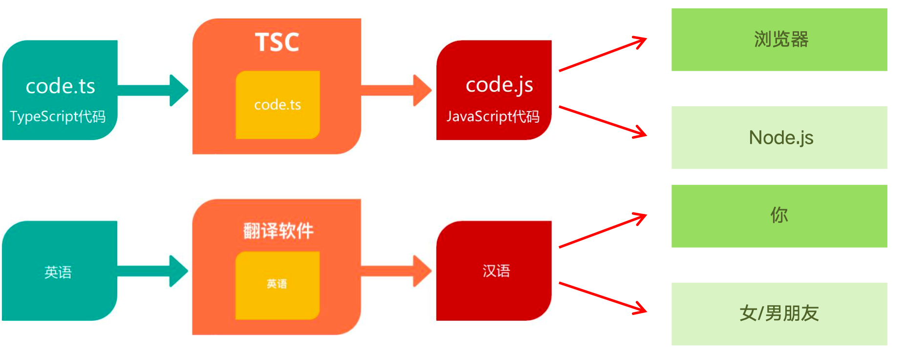

### 「TypeScript概述」

- JavaScript是什么？
  - JS是一种运行在客户端(比如:浏览器)中的编程语言。JavaScript 既能运行在 浏览器 中，也可以运行在 Node.js 中
- TypeScript 是什么？
  - TS是 JavaScript 的超集 ,为 JS 添加了类型系统。TypeScript = Type + JavaScript。


### 「解析 TS 的工具包」

- 安装命令：`npm i -g typescript`

- 解析包的作用：

  

  

### 「TS文件的执行步骤」

传统步骤：

- 输入命令：`tsc xxxx.ts`，获取到一个js文件。
- 再次输入命令：`node xxxx.js`，运行js文件。

简易步骤：

- 安装命令：`npm i -g ts-node`
- 执行命令：`ts-node xxxx.ts`，直接执行命令。


### 「MAC代码注释的快捷键」

```js
// 单行注释——快捷键：command + /
```

```js
/**

 * 多行注释-快捷键

 * shift + option + a

*/

```


