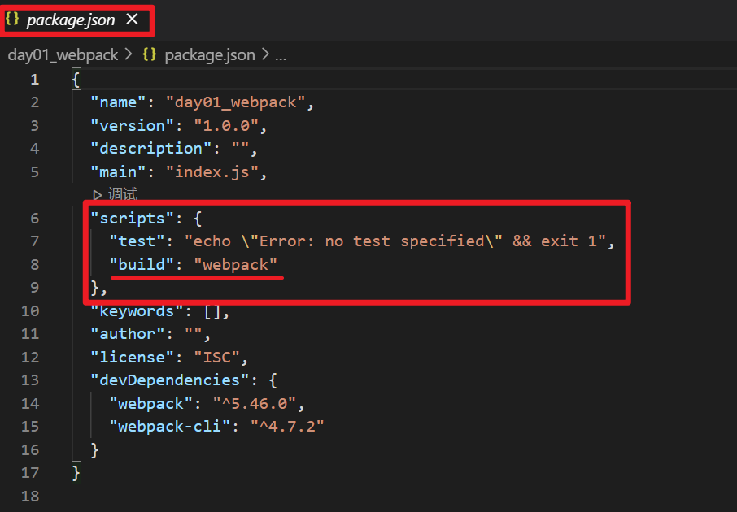
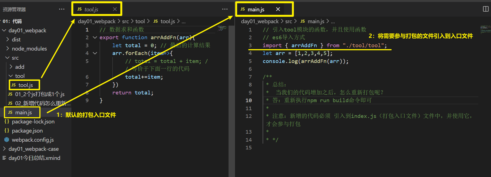
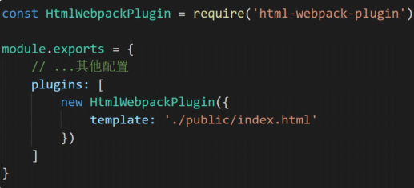
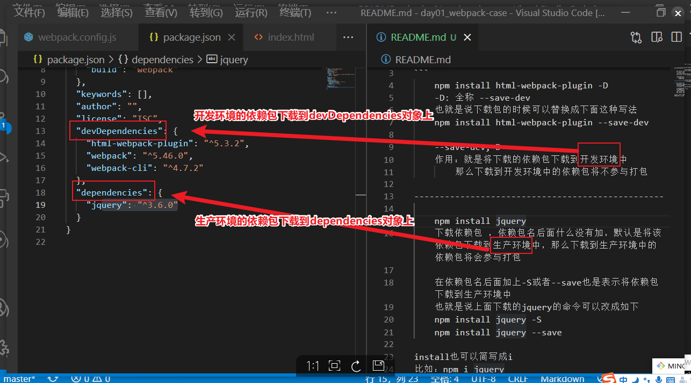
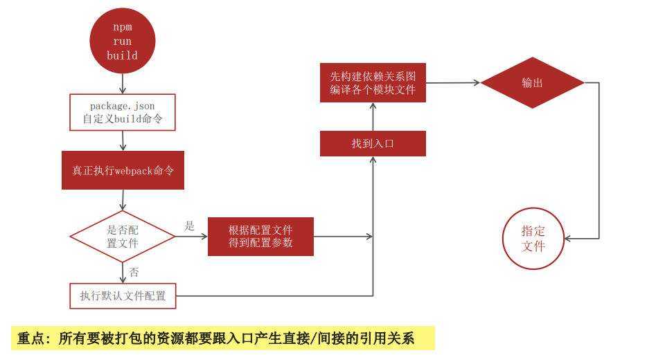
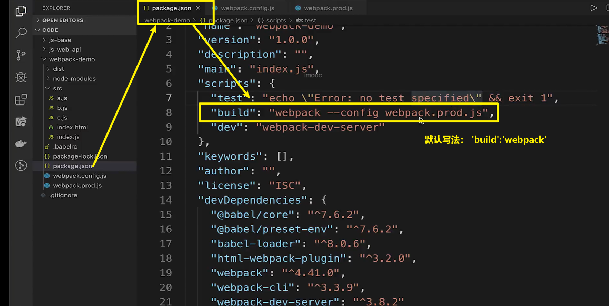
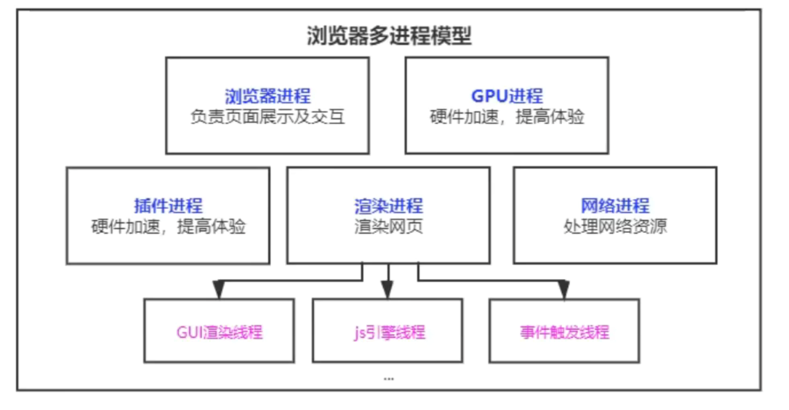

# 「git」

### 1: 


# 「ES6模块化规范」

### 1: export

- 分别导出

  ```js
  export let a = 'a';
  export const b = 'b'
  export const c = ()=>{ console.log(1) }
  ```

  

- 全部导出

  ```js
  let a = 'a';
  const b = 'b'
  const c = ()=>{ console.log(1) }
  export { a, b, c }
  ```


- 导出的时候通过 `as` 取别名

  ```js
  let a = 'a';
  const b = 'b'
  const c = ()=>{ console.log(1) }
  export { a as lang1, b as lang2, c as lang3 }
  ```


### 2: improt

- 通过解构赋值 获取 导入元素

  ```js
  import { a, b, c} from './index.js'
  console.log(a)
  ```

  

- 全部导入

  ```js
  import * from './index.js'
  ```

  

- 导入的时候通过 `as` 取别名

  ```js
  import { a as lang } from './index.js'
  console.log(lang)
  ```

  

### 3: export default

> 总结：
>
> - 输出单个值，使用`export default`
> - 输出多个值，使用`export`
> - `export default`与普通的`export`不要同时使用


- 默认导出

  ```js
  export default function(){
    console.log('123')
  }
  ```

  

- 通过 `import` 导入

  ```js
  import lang from './index.js'
  ```

  

# 「webpack」

### 1: 简介

#### 1.1: webpack的作用

​	①：减少文件数量

​	②：缩减代码体积（打包代码的时候）

​	③：提高浏览器加载速度

#### 1.2: webpack的本质

第三方模块包，是一个用于分析，并且打包代码的工具


### 2: webpack 配置 生产模式

#### 第一步：环境准备

##### 1. 初始化包环境

npm下载: `npm init -y`

##### 2. 下载依赖

npm下载：`npm i webpack webpack-cli -D`

##### 3. 配置自定义打包命令

- 到`package.json`文件处的scripts处设置：`"build"："webpack"`

> 注意：
>
> 1. 这里的webpack是简写，真正的写法：`"build"："webpack --config  webpack.prod.js"`。也就是引入webpack的规则文件。
> 2. build代表的是打包的一个属性名。

如图所示：




#### 第二步：使用步骤

1. 准备打包的入口文件：`src/main.js`

2. 把需要打包的文件引入到入口文件

   如图所示：

   

3. 执行`package.json` 里面的`build`命令。

4. 默认输出的打包结果文件 `dist/main.js`


#### 第三步：修改相关的文件

##### 1. `webpack.prod.js` 文件

作用：修改入口出口

entry：修改入口的属性

output：修改出口的属性


##### 2. 配置自动打包工具

插件名：`html-webpack-plugin`

作用：自动打包html文件，并且会自动引入打包后的js

npm下载语句：`npm install html-webpack-plugin -D`

使用方法：




### 3: webpack的加载器【是不是配置在生产模式中？】

#### 3.1: 打包css文件

##### 步骤一：下载 `loader` 加载器

npm下载：`npm install css-loader style-loader -D`

作用：

- style-loader：将css样式插入到DOM中
- css-loader：让webpack能识别css文件


##### 步骤二：针对css配置【注意看看是哪个模式下的配置，即 是不是mode: ' build '？ 】

```js
// webpack.prod.js文件中配置
module.exports = {
  module: {
    rules : [
      test:/\.css$/i,
      use:["style-loader","css-loader"]
    ]
  }
}
```


##### 步骤三：把index.css引入到入口处【有疑问？最好有图示】


#### 3.2: 打包less文件

##### 步骤一：下载 `loader` 加载器

npm下载：`npm install less less-loader -D`

作用：

- less：用来将less转css
- less-loader：让webpack识别less类型文件


##### 步骤二：针对less配置

```js
// webpack.prod.js文件中配置
module.exports = {
  module: {
    rules : [
      test:/\.less$/,
      use:["style-loader","css-loader","less-loader"]
    ]
  }
}
```


##### 步骤三：把index.cess引入到入口处【？图片，为什么是index.js文件】


#### 3.3: 打包图片

配置:

```js
// webpack.prod.js文件中配置
module: {
  rules: [
    {
      test:/\.(png|jpg|gif|jpeg)$/i,
      type:'asset'
    }
  ]
}
```


> 注意：图片将会被打包成2种类型的文件
>
> - 图片小于8kb的时候，会把图片转成base64字符串。
> - 图片大于8kb的时候，直接将图片输入到打包后的目录中。


#### 3.4: 字体图标

配置：

```js
// webpack.prod.js文件中配置
module: {
  rules: [
    {
      test:/\.(eot|svg|ttf|woff|woff2)$/,
      type:'asset/resource',
      generator: {
        filename:'font/[name].[hash:6][ext]'
      }
    }
  ]
}
```


> 注意：webpack5默认内部不认识这些文件，所以当作静态资源直接输出即可


#### 注意事项

- webpack默认只能处理js文件

- 下载加载器或者插件的语法中有“—D”的差别

  


### 4: 打包命令执行的流程图




### 5: webpack配置开发服务模式

#### 5.1: 作用

①：实时打包项目（打包存在内存中，并且实时将打包后的最新内容反馈到浏览器中）

②：缓存已打包的内容，内容更新只打包更新的内容


#### 5.2: 使用步骤

步骤一：npm下载 `webpack-dev-server -D`

步骤二：配置 运行命令

```json
// package.json文件
{
	...
	"scripts":{
		....
		"dev":"webpack-dev-server"
	}
}
```

步骤三：配置 基本信息

```js
// webpack.config.js文件
module.exports = {
  mode: 'development',
  entry:  path.join(__dirname,'src','index'),
  .....
  devServer:{
    port:3000,//端口号
    contentBase: path.join(__dirname,'dist'), //根目录
    open:true,//自动打开浏览器
  }
}
```

步骤四：运行项目

命令：`npm run dev`


#### 5.3: 注意事项

- 开发服务器一般都是写在开发模式的配置里面，即： webpack.config.js文件中的mode属性必须是：'development'
- 开发模式中的代码是没有被压缩的，方便调试。


### 6: webpack 配置 不同环境的文件

#### 6.1: 文件种类

- 开发环境——webpack.config.js
- 生成环境——webpack.prod.js


#### 6.2: 配置信息

- 开发环境
  - 模式选择：`mode:'development'`（运行后，代码没有被压缩，方便调试）


- 生产环境

  - 模式选择：`mode:'production'`（运行后，代码会进行压缩）

  - 输出配置

    - 输出文件命名中加入hash，有利于浏览器的缓存策略。

      > 如图所示：
      >
      > 

      

  - 运行配置

    > 如图所示：
    >
    > 


# 「babel」

作用

1. ES6模块化，浏览器暂不支持
2. 因为ES6语法，浏览器并不完全支持。所以babel的作用就是ES6=>ES5


使用步骤：

1. npm下载

   `npm i babel-loader @babel/core @babel/preset-env -D`

2. 配置

```js
// webpack.config.js文件中配置
module: {
  rules: [
    {
      test:/\.js$/,
      exclude:/(node_modules|bower_components)/,
      use: {
        loader:'babel-loader',
        options:{
          presets:['@babel/preseet-env']
        }
      }
    }
  ]
}
```


# 「前端常用的Linux命令」

`ls` 当前目录的所有内容。

`ls -a` 当前目录的所有内容（包括隐藏文件夹）。

`cd` 打开目录

`find` 查找文件

`cat` 查看文件内容

`grep`对内容进行过滤

`diff`命令用来比较两个文件是否的差异

`.tar` `gz` 使用tar ,gzip命令操作

`ps`命令能够看到进程/线程状态

`ifconfig`查看ip地址

`ping`测试网络


# 「浏览器渲染原理与性能优化」

### 一. 进程与线程

- 进程是操作系统资源分配的基本单位，进程中包含线程。
- 线程是由进程所管理的。
- 为了提升浏览器的稳定性和安全性，浏览器采用了多进程模型。


浏览器中的（5个）进程



- 浏览器进程：负责界面显示、用户交互、子进程管理、提供存储等。
- 渲染进程：每个也卡都有单独的渲染进程，核心用于渲染页面。
- 网络进程：主要在处理网络资源加载（HTML、CSS、JS等）
- `GPU`进程：3d绘制，硬件加速，提高性能
- 插件进程：chrome中安装的一些插件


### 二. 从输入URL到浏览器显示页面发生了什么？

进程的角度：

- 用户输入url地址（关键字 会将关键字根据默认的引擎生成地址）会开始导航。【此过程发生在：浏览器进程】
- 浏览器进程会准备一个【渲染进程】用于渲染页面
- 【网络进程】加载资源，最终将加载的资源交给【渲染进程】来处理
- 渲染完毕显示


网络七层模型

- 物，数，网，传，（绘，表，应）【其中绘，表，应统称为：应用层】
- 应用层主要的协议是 http协议
- 传输层主要协议是 tcp、udp
- 网络层主要协议是 ip协议

##### 3. HTTP发展历程


##### 4. 渲染流程

图示：


1. 浏览器无法直接使用HTML，需要将HTML转化成DOM树。（`document`）
2. 浏览器无法解析纯文本的css样式，需要对css进行解析，解析成`styleSheets`。`CSSOM` (`document.styleSeets`)
3. 计算出DOM树中每个节点的具体样式
4. 创建渲染（布局）树，将DOM树中可见节点
5. 通过布局树，进行分层（根据定位属性、透明属性、transfrom属性、cllip属性）生成图层树。
6. 将不同图层进行绘制，转交给合成线程处理。最终生成页面，并显示到浏览器上（painting，display）。


> 注意：
>
> 1. css不会阻塞html解析，但会阻塞页面渲染。（样式放到底部，可能会导致重绘效果）
> 2. 当html渲染时，会先扫描js和css渲染从上到下，边解析边渲染。
> 3. js会阻塞dom解析，需要暂停DOM解析去执行js。（js可能会操作样式，所以需要等待样式加载完成）
> 4. js阻塞html解析和渲染，js要等上面的css加载完毕，保证页面js可以操作样式。


### 三. 


# 「前端部署」


​	


