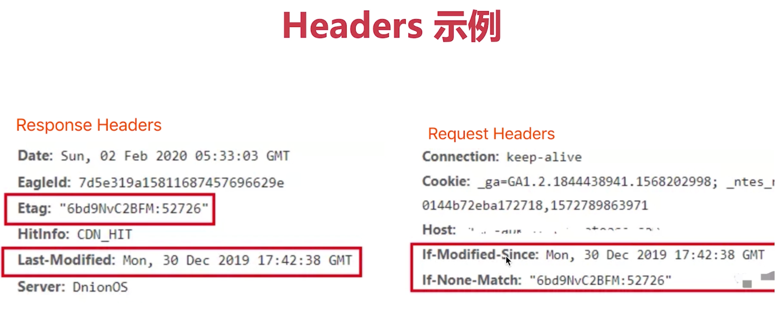

### 关于缓存

- 什么是缓存？
  - 把一些没有必要重新获取的资源，进行缓存。
  - 浏览器缓存一般都是针对静态资源（ js、css、图片等）——「webpack中加的hash」
-  为什么需要缓存？
  - 网络请求的加载相比于cup的计算、页面的渲染。
  - 减少网络请求的体积（带宽）和数量，减轻服务器压力，提升性能

 

### 强制缓存

- 
- Cache-control的值
  - max-age：缓存保质期。
  - no-cache：不对资源进行本地缓存。
  - no-store：不对资源进行缓存（包括本地缓存和服务端缓存）
  - public：允许中间的路由或者协议代理可以缓存。
  - privite：允许客户端可以缓存。
- 关于`Expires`
  - 同在`Response Headers`中
  - 同为控制缓存过期。
  - 已被`Cache-Control`代替

### 协商缓存（对比缓存）

#### 简介

> - 服务器端缓存策略。
> - 服务器判断客户端资源，是否和服务端资源一样。（注意是：服务端做的是判断）
> - 一致则返回304 , 否则返回200和最新的资源。

#### 图解

#### 资源标识

 

### 综述 

### 三种刷新操作

### https--加密协议

#### http和https

- http是明文传输，铭感信息容易被中间劫持。
- https=http+加密，劫持了也无法解密。
- 现代浏览器已经开始强制https协议（“有些网站会出现强制提示“该网站不安全。”）

#### 加密方式

对称加密：一个key同负责加密、解密。成本低、效率高

非对称加密：一对key，A加密之后，只能用B来解密。成本高、效率低。

https同时用到这两种加密方式。

#### https证书

- 中间人攻击
- 使用第三方证书（慎用免费、不合规的证书）【阿里云SSL证书】
- 浏览器校验证书

### https--过程解析

 

 